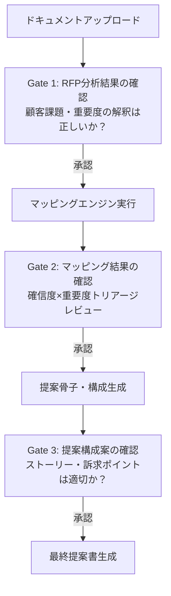
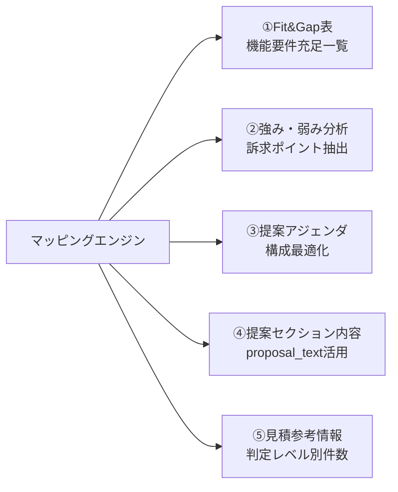
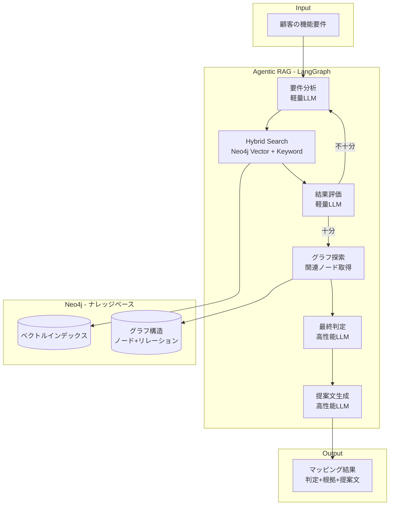
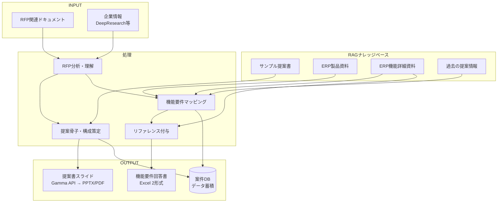
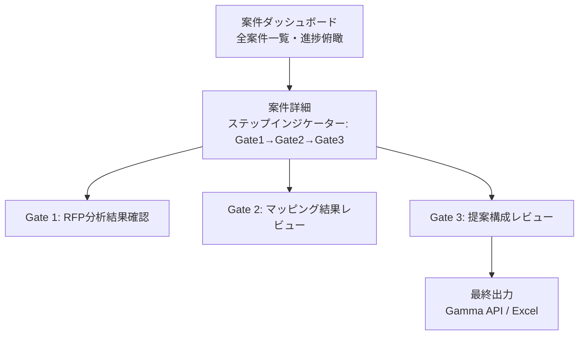
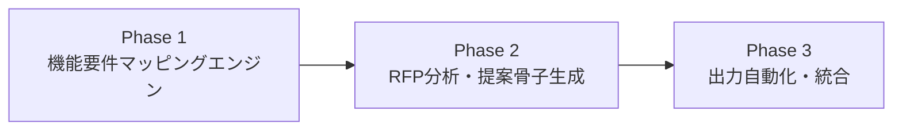

# 仕様概要 - ERP提案書作成支援システム (ProposalCreation)

> **SSoT（Single Source of Truth）**: 本ドキュメントがプロジェクト全体の仕様概要であり、常に最新状態を維持する。
> **最終更新**: 2026-02-18（Rev.13）
> **フェーズ**: 構想・仕様策定

---

## 1. プロジェクト概要

### 1.1 背景
我々はERP（GRANDIT、SAP S/4 HANA Public Edition）を提案し、ERP導入をプライムで推進する会社である。現在、顧客からのRFP（提案依頼書）に対する提案書・見積書の作成は、ベテランの知見に依存した属人的なプロセスであり、品質のばらつきと作成工数の大きさが課題となっている。

### 1.2 目的
RFPの情報をINPUTとし、RAG（Retrieval-Augmented Generation）技術を活用して、提案書の作成と見積書の作成を支援するアプリケーションを構築する。

### 1.3 規模感
- **年間RFP受領件数**: 20〜30件
- 全件に提案するわけではないが、分析・判断の工数も含め自動化の投資対効果は十分

### 1.4 現状の課題と移行背景
現在はNotebookLM + Gemini GEMで以下を実施している:
- RFP資料をNotebookLMにアップロード
- GEMとのやりとりで機能マッピング一覧を作成
- **課題**: Excel直接取込不可、チャンク戦略制御不可、出力の構造化制御に限界、案件ごとの再構築が必要

専用システムを構築することで以下の優位性を得る:
- ERP製品体系に最適化した構造化RAG（Graph RAG / Agentic RAG）
- 5段階判定 + 確信度スコアによるマッピング精度向上
- 構造化データ出力→Gamma API経由でスライド自動生成
- 過去案件のフィードバックによる継続的精度向上

### 1.5 対象ERP製品
- **GRANDIT** - 国産ERP
- **SAP S/4 HANA Public Edition** - グローバルERP

---

## 2. INPUTデータ（Round 4 確定）

### 2.1 RFP関連ドキュメント（個社の提案依頼書）

顧客から提供されるRFP関連ドキュメント。**種別指定アップロード**でユーザーが種別を指定して取り込む。

| # | ドキュメント種別 | 入力形式 | 解析方式 |
|---|----------------|---------|---------|
| 1 | **機能要件一覧** | **Excel(.xlsx)** | openpyxl（表構造の正確な保持が必須） |
| 2 | RFP（提案依頼書）本体 | PDF | pdfplumber |
| 3 | 業務フロー | PDF | pdfplumber |
| 4 | 帳票一覧 | PDF | pdfplumber |
| 5 | 補足資料 | PDF | pdfplumber |

### 2.2 企業情報（ハイブリッド収集）

| 収集方式 | 内容 | 入力形式 |
|---------|------|---------|
| **自動収集**（企業名入力時） | 業種・従業員数・売上高、直近ニュース | Web API / Web検索 |
| **手動アップロード** | 中期経営計画、IR情報、DeepResearch結果 | **Markdown(.md)** |

### 2.3 解析パイプライン

```
Excel(.xlsx) → openpyxl → 構造化テーブル（行=要件）
PDF          → pdfplumber → テキスト+表抽出 → LLM補完で構造化
Markdown     → そのままパース → LLM補完で構造化
                    ↓
            RFP分析結果（中間成果物）
```

### 2.4 RFP分析の中間成果物

RFP分析結果として以下を構造化データで出力。後続の全処理のINPUTとなる。

- **顧客課題サマリー**: 主要課題（3〜5項目）
- **評価基準**: 機能充足度、導入実績、費用、体制等の重み付け
- **スケジュール要件**: 本稼働目標時期、マイルストーン
- **業種・規模情報**: 業種、従業員数、売上高
- **機能要件一覧（構造化済み）**: 要件ID / 要件内容 / 重要度(Must/Should/Could) / カテゴリ

### 2.5 ステージゲート（3ゲート方式）



---

## 3. 処理概要（Round 2 確定）

### 3.0 処理の全体思想

マッピングエンジンは単なるFit&Gap表の作成ではなく、**提案全体の整合性と訴求力の基盤データ**を生成する。



| # | マッピング結果の活用先 | 活用方法 |
|---|----------------------|---------|
| ① | Fit&Gap表 / 機能要件回答書 | 5段階判定 + 確信度 + 根拠を直接出力 |
| ② | 提案の強み・弱み分析 | 標準対応(High)が多い領域 = 訴求ポイント、アドオン/Low = リスク対策 |
| ③ | 提案書アジェンダ・構成 | 強みの業務領域をメインに、Must要件への回答を厚く展開 |
| ④ | 提案書セクション内容 | 各マッピングの`proposal_text`が提案書の素材に直結 |
| ⑤ | 見積参考情報（手動見積の参考） | 判定レベル別件数を提供。見積自体はスコープ外 |

### 3.1 機能要件マッピング（Phase 1 - Round 2 確定）

**検索・照合方式**: Agentic RAG（内部でHybrid Search使用）
- LLMエージェントが要件を分析→検索クエリ自律生成→検索→結果不十分なら再検索
- Hybrid Search: ベクトル類似度 + キーワード検索の組み合わせ

**判定レベル（製品別・実装手段ベース）**:

| レベル | 定義 | 判定基準 | SAP | GRANDIT |
|--------|------|---------|-----|---------|
| 標準対応 | ERP標準機能でそのまま実現 | Scope Itemの標準フローでカバー | 対応 | 対応 |
| 標準（業務変更含む） | 標準機能 + 設定変更または業務運用変更で対応可能 | パラメータ設定・業務フロー調整で実現、コード開発不要 | 対応 | 対応 |
| アドオン開発 | 追加プログラム開発が必要 | 標準機能の拡張/外側でのカスタム開発 | 対応 | - |
| カスタマイズ | コアロジックの改修・拡張で実現 | ERP内部のカスタマイズ開発 | - | 対応 |
| 外部連携 | 他システム連携で実現 | API/IF開発が必要 | 対応 | 対応 |
| 対象外 | ERP導入スコープ外 | 専用システム領域 or 要件不明確 | 対応 | 対応 |

> **注**: SAP S/4 HANA Public EditionはPublic Cloudのためコアロジック改修不可（アドオン開発で対応）。GRANDITはオンプレミスのためコアカスタマイズ可能。判定レベルは製品別に設定テーブル/Enumで管理し、将来の製品追加・レベル追加にも拡張可能な設計とする（詳細: spec/phase1-mapping-engine/design.md ADR-009）。

**確信度スコア**: 検索スコア + LLM自己評価の複合（High/Medium/Low）

**出力構造**: 判定 + 根拠 + 提案文（提案書転記可能レベル）

**レビューフロー**: 確信度 × 顧客重要度（Must/Should/Could）のトリアージ
- Must × Low = 最優先レビュー
- High全般 = 軽確認

### 3.2 提案骨子・構成のアレンジメント（Phase 2 - Round 5 確定）

**過去提案書の構造化**: 2層構造（構成テンプレート + セクション内容）
- 構成テンプレート層: 業種×規模ごとの「どのセクションをどの順序で」のパターン
- セクション内容層: 各セクションの良い表現・記載パターン

**構成生成ロジック**: LLM生成 + テンプレート参照
- LLMがRFP分析結果・マッピング結果・過去テンプレートを参照し最適な構成を生成
- RFPの評価基準（機能充足度の重みが高ければ機能セクションを厚く等）を反映

**マッピング結果→提案書への変換**: 業務領域集約 + 強み訴求
- マッピング結果を業務領域（販売/購買/会計...）でグルーピングし提案ストーリーに再構成
- 提案書の「貴社システム要求に対するご回答」「要求事項に対するソリューションの実現方法」等の定番セクションにproposal_textを織り込む
- 標準対応率が高い領域を抽出し「本提案の強み」として訴求

```
セクション構成イメージ:
├── 貴社の課題認識（RFP分析結果ベース）
├── 導入方針
├── ソリューション概要
├── 貴社システム要求に対するご回答 ← マッピング結果の集約先
│   ├── 本提案の強み（標準対応率の高い領域を強調）
│   ├── 販売管理領域（proposal_text集約）
│   ├── 購買管理領域（proposal_text集約）
│   ├── 会計管理領域（proposal_text集約）
│   └── ...
├── 導入アプローチ・スケジュール
├── プロジェクト体制
└── 費用概算
```

**トーン・スタイル制御**: スタイルガイド + Few-shot（過去提案書の良い表現例を提示）

**反復改善**: セクション単位の差分編集（Gate 3フィードバック時、該当セクションのみ再生成）
- 将来的に対話型リファインメントに拡張

### 3.3 見積書作成（スコープ外 - Round 6 確定）

**見積書の自動生成はスコープ外**とする。見積は判断要素が多く自動化のROIが不透明なため、従来通り手動作成。

ただし、マッピング結果（判定レベル別の件数・内訳）は見積検討の**参考情報**として活用可能:
- 標準対応 → 設定工数のみ
- 設定変更 → 軽微な設定工数
- アドオン開発 → 開発工数が発生
- 外部連携 → IF開発工数が発生

---

## 4. RAGナレッジベース設計（Round 1 確定）

### 4.1 ナレッジソース一覧

| # | ナレッジ種別 | 内容 | 用途 |
|---|-------------|------|------|
| 1 | SAP Scope Item資料 | 業務シナリオ単位のフロー・操作資料 | 機能マッピング（主ナレッジ） |
| 2 | ERP モジュール紹介資料 | 各モジュールの機能紹介（デモ対応レベル） | 機能マッピング・リファレンス |
| 3 | サンプル提案書 | 過去に作成した提案書群 | 提案骨子・構成の参考 |
| 4 | 過去の提案情報 | 過去提案で使用した情報・回答 | 機能要件回答の参考 |
| 5 | 企業情報 | DeepResearch結果等 | 提案カスタマイズ |

### 4.2 ナレッジ粒度

ERP製品側が定義している**業務シナリオ単位**をナレッジの基本単位とする。

| ERP製品 | ナレッジ単位 | 具体例 | 想定レコード数 |
|---------|------------|--------|-------------|
| SAP S/4 HANA | **Scope Item単位** | 1B4-受注から入金, 1NS-購買発注処理 等 | 200〜400件 |
| GRANDIT | **モジュール紹介の機能セクション単位** | 販売-受注登録, 購買-発注処理 等 | 100〜300件 |

### 4.3 スキーマ設計

**製品別スキーマ**で管理する（SAP用/GRANDIT用を独立管理）。

各ナレッジレコードの構造（グラフ構造: ノード + リレーション）:

```json
{
  "id": "SAP-1B4",
  "product": "SAP S/4 HANA Public Edition",
  "module": "SD",
  "scope_item_id": "1B4",
  "function_name": "受注から入金",
  "description": "顧客からの受注登録、出荷処理、請求処理、入金消込までの一連のプロセスをカバーする標準シナリオ。",
  "business_domain": "販売",
  "capability_level": "standard",
  "keywords": ["受注", "出荷", "請求", "入金", "SO", "受注伝票"],
  "source_doc": "SAP_ScopeItem_1B4_v2024FPS02.pdf",
  "product_version": "SAP S/4 HANA 2024 FPS02",
  "relations": {
    "prerequisite": ["SAP-2WJ"],
    "related": ["SAP-BD6", "SAP-1F3"],
    "follow_on": ["SAP-2K4"]
  }
}
```

グラフ構造により、1つの要件にヒットした際に**関連する前提機能・後続機能も提示可能**。

**ModuleOverviewノード**（モジュール紹介資料由来）:

```json
{
  "id": "MO-SD-inventory-sales",
  "product": "SAP S/4 HANA Public Edition",
  "product_namespace": "SAP",
  "module": "SD",
  "module_name": "SD在庫販売ソリューション",
  "summary": "Discovery WS用モジュール紹介資料から抽出。在庫販売の受注→出荷→請求→入金フローの概要、主要Scope Item（BD9, 1B4等）のカバー範囲、業務シナリオ別の適用パターンを要約。",
  "source_doc": "20240527_01_Discovery WS用_SAP S4HANA Cloud Public Edition_SDソリューション(在庫販売).pdf",
  "page_count": 39,
  "covers": ["SAP-BD9", "SAP-1B4", "SAP-BDG"]
}
```

ModuleOverviewノードは `:COVERS` リレーションで配下のScopeItemと接続し、モジュール横断の文脈情報をマッピング判定時に提供する。

### 4.4 ナレッジ取り込み方式

**AI半自動変換 + 人間レビュー**:
1. LLMが資料を読み取り、上記スキーマに自動変換
2. ERP知見者がレビュー・修正（特にmodule分類、capability_level、relations）
3. 承認されたデータのみナレッジベースに投入

### 4.5 バージョニング

**最新版のみ管理**（簡易バージョン情報付き）:
- 各レコードに `product_version` フィールドを保持
- 大規模な機能変更は稀であり、過剰なバージョン管理は不要
- 更新時は既存レコードを上書き

---

## 5. OUTPUT設計（Round 6 確定）

| # | OUTPUT | 説明 | 出力手段 | ステータス |
|---|--------|------|---------|-----------|
| 1 | 提案書（スライド） | RFP分析+マッピング結果に基づく提案書 | **Gamma API** → PPTX/PDF | Round 6確定 |
| 2 | 機能要件回答書 | 機能要件一覧への回答（5段階判定+確信度+根拠） | **Excel（2形式）** | Round 6確定 |
| 3 | 見積書 | 工数・費用見積 | **スコープ外**（手動作成） | Round 6確定 |

### 5.1 スライド生成: Gamma API連携

**方式**: 一括生成 + セクション単位再生成

- **Gamma**（gamma.app）のAPI v1.0（2025年11月GA）を利用
- JSON/Markdown入力 → プレゼンテーション自動生成 → PPTX/PDFエクスポート
- テーマ・トーン・言語のカスタマイズ対応
- 1リクエスト最大100,000トークン（約40万文字）

**生成フロー**:
```
提案構成案（Gate 3承認済み）
    ↓
全セクション → Gamma API一括生成 → PPTX/PDF
    ↓
Gate 3フィードバック時 → 該当セクションのみ再生成
```

- トライアンドエラーでAPI活用方法を最適化する方針
- セクション単位のJSON構造でGamma APIに渡し、再生成時は変更セクションのみ差し替え

### 5.2 機能要件回答書: Excel出力（2形式）

**方式**: 顧客指定フォーマット書き戻し + 自社フォーマット

| 形式 | 説明 | 用途 |
|------|------|------|
| **顧客フォーマット書き戻し** | 顧客のRFP Excel（機能要件一覧）に回答列を追記 | RFP回答提出用 |
| **自社Fit&Gap表** | 自社標準のFit&Gap表フォーマットで出力 | 社内レビュー・提案書素材用 |

- openpyxlでセル単位書き込み（書式保持）
- 出力項目: 判定レベル / 確信度 / 対応方針（proposal_text要約） / 根拠

### 5.3 案件データ管理・ナレッジ蓄積

**初期**: DB管理 → **将来**: ナレッジフィードバック

| フェーズ | 内容 |
|---------|------|
| **初期（DB管理）** | 案件ごとのRFP・マッピング結果・提案書をDBで構造化管理。案件データの散逸を防止 |
| **将来（ナレッジフィードバック）** | 承認済みマッピング結果をナレッジベースにフィードバック。「この要件→この判定」の確定情報が蓄積され精度が向上 |

### 5.4 セキュリティ・データ保護

**初期**: クラウドLLM API → **必要時**: プライベート環境移行

| 項目 | 方針 |
|------|------|
| LLM API | Claude API / OpenAI APIをクラウド利用 |
| 通信 | TLS暗号化 |
| 認証 | APIキー管理（環境変数 / Secret Manager） |
| データ保持 | 各LLMプロバイダのデータ保持ポリシーを確認・遵守 |
| 移行条件 | 顧客機密情報の取扱い要件が厳格化した場合、Azure OpenAI等プライベートエンドポイントへ移行 |

---

## 6. 技術アーキテクチャ（Round 3 + Round 7 確定）

### 6.0 技術スタック総覧（Round 7 確定）

| レイヤー | 技術 | 選定理由 |
|---------|------|---------|
| **フロントエンド** | Next.js（React / App Router） | 生成AI開発との相性が最良。学習データ豊富でコード生成精度が高い。ファイルベースルーティングで画面構造が明示的。shadcn/ui等のUIエコシステムが最大 |
| **バックエンド** | FastAPI（Python） | LangGraph/openpyxl/pdfplumberとPython統一。async/awaitネイティブ。Pydanticバリデーション |
| **案件管理DB** | PostgreSQL | リレーショナル構造（案件→ドキュメント→マッピング→提案書）。JSON/JSONB型で半構造化データも対応 |
| **ナレッジDB** | Neo4j（ベクトルインデックス内蔵） | ERP製品ナレッジ専用。グラフ探索+ベクトル検索 |
| **Embedding** | OpenAI text-embedding-3-large | 日本語+英語+ERP略語の多言語対応 |
| **Agentic RAG** | LangGraph | ステートマシンベースのエージェント制御 |
| **LLM** | 段階的使い分け（Haiku/GPT-4o-mini + Sonnet/GPT-4o） | コスト・速度最適化 |
| **スライド生成** | Gamma API v1.0 | JSON/MD → PPTX/PDF |
| **Excel処理** | openpyxl | 読込・書き戻し（書式保持） |
| **PDF解析** | pdfplumber | テキスト+表抽出 |
| **インフラ（初期）** | Docker Compose | 全コンポーネントを1つのdocker-compose.ymlで管理 |
| **インフラ（将来）** | GCP or AWS マネージド | 需要増加・セキュリティ要件に応じて移行 |
| **CI/CD** | GitHub Actions | テスト自動化 |
| **LLMモニタリング** | LangSmith | 実行トレーシング・マッピング精度評価・ドリフト検知 |
| **テスト** | Pytest | バックエンドテスト |

### 6.1 データ基盤

| コンポーネント | 技術 | 選定理由 |
|--------------|------|---------|
| **グラフDB + ベクトル検索** | Neo4j（ベクトルインデックス内蔵） | グラフ探索がファーストクラス操作。300-700ノード規模では統合型が最適。Cypher + ベクトル検索をワンクエリで実行可能 |
| **Embeddingモデル** | OpenAI text-embedding-3-large（3,072次元） | 日本語+英語+ERP略語の混在テキストに対する多言語理解力。差し替え可能な設計（ベクトル再生成で対応） |

### 6.2 エージェント基盤

| コンポーネント | 技術 | 選定理由 |
|--------------|------|---------|
| **Agentic RAGフレームワーク** | LangGraph（LangChain系） | 要件分析→検索→判定→再検索のステートマシンをグラフで明示的に定義。デバッグ・拡張が容易 |
| **LLM（推論モデル）** | 段階的使い分け | 軽量モデル（検索クエリ生成・関連性判定）と高性能モデル（最終判定・提案文生成）を使い分け、コスト・速度を最適化 |

LLM使い分け:
| 処理ステップ | モデル層 | 候補 |
|-------------|---------|------|
| 要件分析・検索クエリ生成 | 軽量・高速 | Claude Haiku / GPT-4o-mini |
| 検索結果の関連性判定 | 軽量・高速 | Claude Haiku / GPT-4o-mini |
| 最終マッピング判定 | 高性能 | Claude Sonnet / GPT-4o |
| 提案文（proposal_text）生成 | 高性能 | Claude Sonnet / GPT-4o |

### 6.3 アーキテクチャ概念図



### 6.4 PoC計画

**スコープ: 実案件PoC（過去RFP 1案件フル処理）**

| 項目 | 内容 |
|------|------|
| ナレッジ | SAP全モジュールのScope Item + モジュール紹介資料をフル投入 |
| INPUT | 過去の実RFP 1案件分（機能要件一覧含む） |
| 正解データ | 同案件で実際に作成した機能マッピング結果・提案書 |

検証ポイント:
1. **マッピング精度** - 人間の判定（正解データ）との一致率
2. **グラフ探索の有効性** - 関連機能が適切に提示されるか
3. **提案文の品質** - そのまま提案書に転記できるレベルか
4. **処理速度・コスト** - 1要件あたりの所要時間・API費用

---

## 7. 処理フロー概要



---

## 8. UI/UX設計（Round 8 確定）

### 8.1 画面構成・ナビゲーション

**方式**: ハイブリッド（ダッシュボード + ステップインジケーター）



- 案件ダッシュボードで全案件（20-30件/年）の進捗を俯瞰
- 各案件詳細画面にGate 1→2→3のステップインジケーター配置
- 各Gate画面には自由にアクセス可能（手戻り容易）

### 8.2 Gate 2: マッピング結果レビュー画面

**方式**: テーブル + サイドパネル（マスター/ディテール）

```
┌──────────────────────────────┬─────────────────────────┐
│ フィルタ: [要レビュー▼] [全件]     │  詳細パネル              │
│                              │                         │
│ 要件名    │判定│確信度│重要度│   │  要件: 受注登録機能        │
│ 受注登録  │標準│High │Must │←  │  判定: 標準対応            │
│ 在庫引当  │設定│Med  │Must │   │  根拠: Scope Item 1B4...  │
│ 特殊請求  │ｱﾄﾞｵﾝ│Low  │Must │   │  proposal_text: ...       │
│ ...       │    │     │     │   │  関連ノード: [1F3] [2K4]  │
│                              │  [承認] [修正] [再検索]    │
└──────────────────────────────┴─────────────────────────┘
```

- フィルタプリセット: 「要レビュー（Must×Low）」「承認済み」「全件」
- サイドパネル: 検索根拠、proposal_text、関連ノード、LangSmithトレースリンク
- TanStack Table でフィルタ・ソート・仮想スクロール

### 8.3 リアルタイム処理フィードバック

**方式**: ストリーミング結果表示（SSE: Server-Sent Events）

- マッピング完了した要件から**順次テーブルに追加**（処理中でもレビュー開始可能）
- 全体進捗バー（`85/200件処理中`）を常時表示
- FastAPI StreamingResponse + SSE で実装
- LangGraphの各ステップ完了をイベントとして発火

### 8.4 Gate 3: 提案構成レビュー画面

**方式**: アウトライン（左）+ プレビュー（右）の2ペイン

```
┌──────────────────────┬───────────────────────────────┐
│ セクション構成          │  プレビュー                     │
│                      │                               │
│ ▼ 貴社の課題認識       │  ## 貴社システム要求に対するご回答   │
│ ▼ 導入方針            │                               │
│ ▼ ソリューション概要    │  ### 販売管理領域               │
│ ▼ 貴社要求へのご回答 ←  │  受注から入金までの一連のプロセスは │
│   ├ 本提案の強み       │  SAP標準機能で対応可能です...     │
│   ├ 販売管理領域       │                               │
│   ├ 購買管理領域       │  [承認] [再生成（コメント付き）]   │
│   └ 会計管理領域       │                               │
│ ▼ 導入スケジュール     │                               │
│ ▼ プロジェクト体制     │                               │
└──────────────────────┴───────────────────────────────┘
```

- 左ペイン: セクションツリー（dnd-kitでドラッグ&ドロップ並替）
- 右ペイン: 選択セクションのproposal_text + Markdownプレビュー
- セクション単位で「承認」「再生成リクエスト（コメント付き）」アクション

### 8.5 デザインシステム

| コンポーネント | ライブラリ | 用途 |
|--------------|----------|------|
| ベースUI | **shadcn/ui + Tailwind CSS** | Button, Dialog, Sheet, Card 等の基本コンポーネント |
| テーブル | **TanStack Table** | マッピング結果一覧（フィルタ・ソート・仮想化） |
| ドラッグ&ドロップ | **dnd-kit** | Gate 3のセクション並替 |

---

## 9. 開発フェーズ計画

### Phase構成



| Phase | 名称 | 概要 | 価値 |
|-------|------|------|------|
| **Phase 1** | 機能要件マッピングエンジン | ERP製品ナレッジのRAG構築、機能要件への自動マッピング | NotebookLMを超える精度・構造化が最も効果を出しやすい |
| **Phase 2** | RFP分析・提案骨子生成 | RFPドキュメント取込・分析、提案構成の自動生成 | Phase 1の精度確認後に拡張 |
| **Phase 3** | 出力自動化・統合 | Gamma APIスライド生成、Excel 2形式出力、案件DB管理、全体統合（見積はスコープ外） | 実用性が証明されてから投資 |

### 仕様策定Q&Aロードマップ

仕様はQ&A形式で段階的に決定し、本ドキュメントに蓄積する。**全8ラウンド完了。**

| # | テーマ | 対象Phase | 主な論点 | ステータス |
|---|--------|----------|---------|-----------|
| **Round 1** | ERP製品ナレッジの構造化設計 | Phase 1 | ナレッジの粒度、分類体系、データ構造 | **完了** |
| **Round 2** | マッピングエンジンの処理設計 | Phase 1 | マッピングロジック、判定基準、確信度算出 | **完了** |
| **Round 3** | RAGアーキテクチャ選定 | Phase 1 | ベクトルDB、Graph RAG、検索戦略 | **完了** |
| **Round 4** | RFPドキュメント取込・分析設計 | Phase 2 | 取込方式、解析パイプライン、ステージゲート | **完了** |
| **Round 5** | 提案骨子生成の設計 | Phase 2 | アレンジメント方式、サンプル提案書の構造化 | **完了** |
| **Round 6** | 出力・外部連携設計 | Phase 3 | Gamma API連携、Excel出力、見積スコープ外、案件管理、セキュリティ | **完了** |
| **Round 7** | 技術スタック確定 | 全体 | FastAPI、Next.js、PostgreSQL、Docker Compose、LangSmith | **完了** |
| **Round 8** | UI/UX設計 | 全体 | ハイブリッドUI、テーブル+サイドパネル、SSEストリーミング、2ペイン構成、shadcn/ui | **完了** |

---

## 10. 仕様策定ステータス

| 領域 | ステータス | 備考 |
|------|-----------|------|
| 全体概要 | **確定** | 全8ラウンドQ&A完了。Phase 1詳細設計開始 |
| INPUTデータ定義 | **Round 4 確定** | 入力形式（Excel/PDF/MD）、解析パイプライン、ステージゲート確定 |
| 処理フロー詳細 | **Round 2 確定** | マッピングエンジンの処理設計確定 |
| RAGナレッジ設計 | **Round 1 確定** | スキーマ・粒度・取込方式確定 |
| 技術アーキテクチャ | **Round 3+7 確定** | Neo4j、LangGraph、LLM段階的使い分け、PoC計画、技術スタック全体確定 |
| OUTPUT形式定義 | **Round 6 確定** | Gamma APIスライド生成、Excel 2形式出力、見積スコープ外、DB管理→ナレッジFB拡張、クラウドAPI |
| UI/UX設計 | **Round 8 確定** | ハイブリッドUI、テーブル+サイドパネル、SSEストリーミング、2ペイン構成、shadcn/ui+TanStack+dnd-kit |

---

## 11. 変更履歴

| 日付 | 変更内容 | 変更者 |
|------|---------|--------|
| 2026-02-17 | 初版作成 - 構想段階の概要をINPUT | - |
| 2026-02-17 | Rev.2 - 規模感（年間20-30件）、現状課題、Phase計画、Gamma API連携、Q&Aロードマップ追加 | - |
| 2026-02-17 | Rev.3 - Round 1完了。ナレッジ粒度（Scope Item/業務シナリオ単位）、製品別スキーマ、グラフ構造、AI半自動取込、最新版管理を確定 | - |
| 2026-02-17 | Rev.4 - Round 2完了。Agentic RAG、5段階判定、確信度複合スコア、提案文出力、トリアージレビュー確定。処理の全体思想（マッピング→提案一気通貫）を追加 | - |
| 2026-02-17 | Rev.5 - Round 3完了。Neo4j統合型、OpenAI Embedding、LangGraph、LLM段階的使い分け、実案件PoC計画を確定。技術アーキテクチャ概念図追加 | - |
| 2026-02-17 | Rev.6 - Round 4完了。入力形式（Excel/PDF/MD）、種別指定アップロード、専用パーサー+LLM補完、中間分析、3ゲート方式、DeepResearchハイブリッド統合を確定 | - |
| 2026-02-17 | Rev.7 - Round 5完了。提案書2層構造、LLM生成+テンプレート参照、業務領域集約+強み訴求、定番セクション（「貴社要求へのご回答」等）へのproposal_text織り込みを確定 | - |
| 2026-02-17 | Rev.8 - Round 6完了。Gamma API一括生成+セクション再生成、Excel 2形式出力（顧客書き戻し+自社Fit&Gap）、見積スコープ外、案件DB管理→ナレッジFB拡張、クラウドLLM API+移行パスを確定 | - |
| 2026-02-17 | Rev.9 - Round 7完了。技術スタック確定: FastAPI（BE）、Next.js App Router（FE）、PostgreSQL（案件DB）、Docker Compose（初期インフラ）、LangSmith（LLMモニタリング）。技術スタック総覧を追加 | - |
| 2026-02-17 | Rev.10 - Round 8完了。UI/UX設計: ハイブリッドUI（ダッシュボード+ステップインジケーター）、Gate 2テーブル+サイドパネル、SSEストリーミング、Gate 3 2ペイン構成、shadcn/ui+TanStack Table+dnd-kit。**全8ラウンドQ&A完了** | - |
| 2026-02-17 | Rev.11 - 仕様策定フェーズ確定。Steeringファイル更新（tech.md確定版、structure.md実装構造反映、product.md Phase 1スコープ追記）。Phase 1詳細設計開始（spec/phase1-mapping-engine/） | - |
| 2026-02-17 | Rev.12 - CCSDDレビュー指摘反映。判定レベル表を製品別（SAP/GRANDIT）に拡張し「設定変更」→「標準（業務変更含む）」に名称変更、GRANDIT固有「カスタマイズ」レベル追加。Section 4.3にModuleOverviewノードスキーマ例を追記。requirements.md/design.mdとの整合性確保 | - |
| 2026-02-18 | Rev.13 - Phase 1 tasks.md作成完了。6フェーズ30タスク（A:インフラ6, B:ナレッジPL6, C:エンジンコア10, D:API3, E:フロントエンド5, F:統合PoC5→うちチューニングはP2）。クリティカルパス・並行作業推奨・依存関係図を含む | - |
