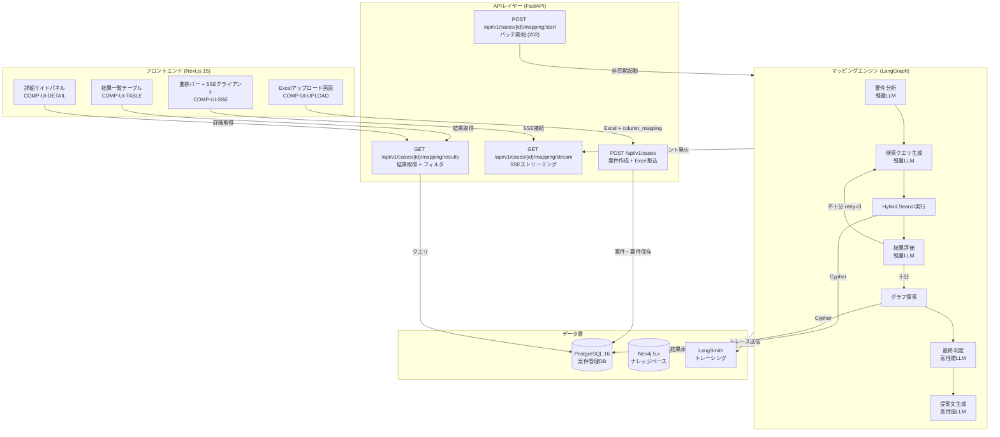
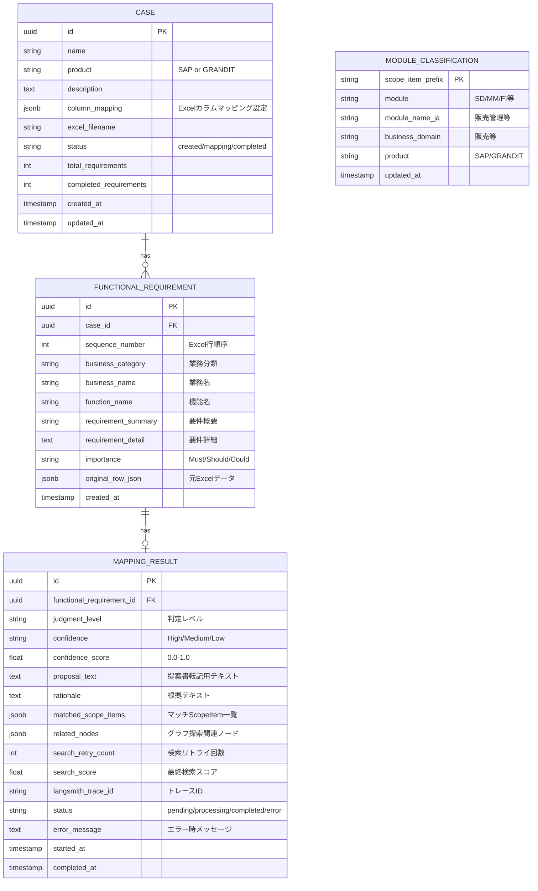
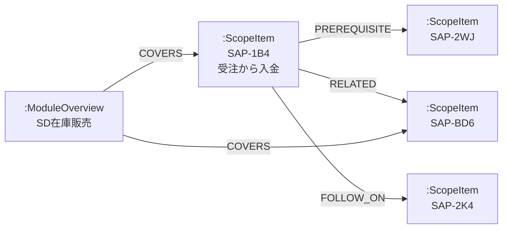
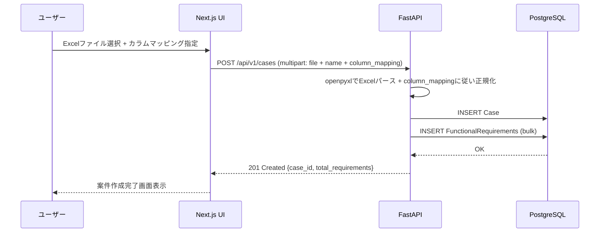
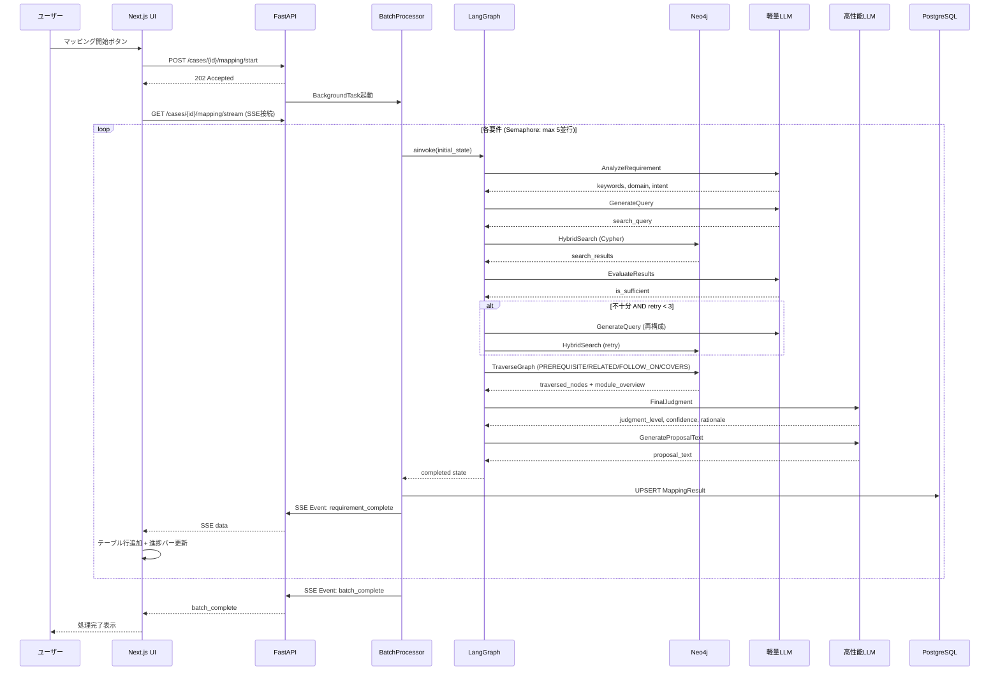
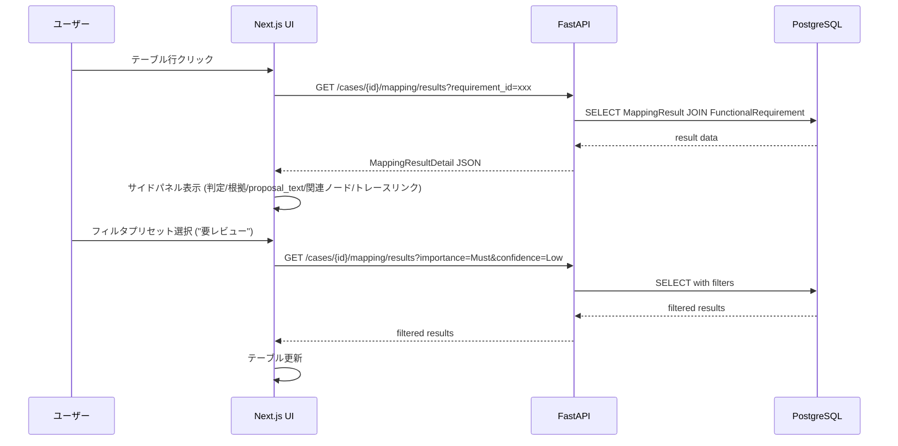

# Design: Phase 1 - 機能要件マッピングエンジン

> **ステータス**: Draft
> **対象Phase**: Phase 1
> **参照**: spec/phase1-mapping-engine/requirements.md / spec/overview.md Section 3〜6, 8

---

## サマリーテーブル

| コンポーネントID | コンポーネント名 | 技術 | 目的 | 対応要件 |
|----------------|----------------|------|------|---------|
| COMP-PARSER-BPD | BPDパーサー | python-docx, openpyxl, LLM(軽量) | Scope Item BPD解析→ScopeItemノード生成 | REQ-MAP-001 |
| COMP-PARSER-PDF | PDFパーサー | pdfplumber, LLM(軽量) | モジュール紹介PDF解析→ModuleOverviewノード生成 | REQ-MAP-001a |
| COMP-LOADER | Neo4jローダー | neo4j driver, OpenAI Embedding API | グラフ投入・Embedding生成・インデックス構築 | REQ-MAP-002, 004, 005 |
| COMP-SEARCH | Hybrid検索サービス | Neo4j Cypher (vector + fulltext) | ベクトル+キーワード複合検索 | REQ-MAP-003, 006 |
| COMP-MASTER | モジュール分類マスター | PostgreSQL | Scope Item ID→モジュール対応表管理 | REQ-MAP-007 |
| COMP-AGENT | LangGraphエージェント | LangGraph | Agentic RAGステートマシン制御・バッチ処理 | REQ-MAP-010, 015, 016, 018 |
| COMP-EVALUATE | 結果評価ノード | LLM(軽量) | 検索結果十分性判定・再検索要否決定 | REQ-MAP-016 |
| COMP-TRAVERSE | グラフ探索ノード | Neo4j Cypher | prerequisite/related/follow_on/COVERS探索 | REQ-MAP-017 |
| COMP-JUDGE | 最終判定ノード | LLM(高性能) | 判定レベル・確信度・根拠生成 | REQ-MAP-011, 012, 014 |
| COMP-GENERATE | 提案文生成ノード | LLM(高性能) | proposal_text生成 | REQ-MAP-013 |
| COMP-API-CASE | 案件管理API | FastAPI | 案件作成・Excel取込・カラムマッピング | REQ-MAP-020, 024 |
| COMP-API-MAP | マッピングAPI+SSE | FastAPI StreamingResponse | マッピング開始・SSE配信・結果取得 | REQ-MAP-021, 022, 023 |
| COMP-TRACING | LangSmithトレーシング | LangSmith SDK | 全LLM呼び出し・LangGraphステップのトレース | REQ-MAP-025 |
| COMP-UI-UPLOAD | Excelアップロード画面 | Next.js + shadcn/ui | ファイルアップロード・カラムマッピングUI | REQ-MAP-030 |
| COMP-UI-TABLE | 結果一覧テーブル | TanStack Table | マッピング結果表示・フィルタ・ソート | REQ-MAP-031, 034 |
| COMP-UI-DETAIL | 詳細サイドパネル | shadcn/ui Sheet | 判定詳細・proposal_text・トレースリンク表示 | REQ-MAP-032 |
| COMP-UI-SSE | SSEクライアント | EventSource API | リアルタイム進捗・結果ストリーミング受信 | REQ-MAP-033 |
| COMP-ACCURACY | PoC精度評価スクリプト | Python CLI, openpyxl | 人間判定との一致率算出・Confusion Matrix・レポート生成 | NFR-MAP-003 |

---

## システムアーキテクチャ

### 全体アーキテクチャ



### LangGraphステートマシン

```mermaid
flowchart LR
    START((開始)) --> ANALYZE_REQ["AnalyzeRequirement<br/>要件分析<br/>(軽量LLM)"]
    ANALYZE_REQ --> GEN_QUERY["GenerateQuery<br/>検索クエリ生成<br/>(軽量LLM)"]
    GEN_QUERY --> HYBRID_SEARCH["HybridSearch<br/>Neo4j検索実行"]
    HYBRID_SEARCH --> EVAL_RESULTS["EvaluateResults<br/>結果評価<br/>(軽量LLM)"]
    EVAL_RESULTS -->|"sufficient=true"| TRAVERSE_GRAPH["TraverseGraph<br/>グラフ探索"]
    EVAL_RESULTS -->|"sufficient=false<br/>AND retry_count < 3"| GEN_QUERY
    EVAL_RESULTS -->|"sufficient=false<br/>AND retry_count >= 3"| TRAVERSE_GRAPH
    TRAVERSE_GRAPH --> FINAL_JUDGE["FinalJudgment<br/>最終判定<br/>(高性能LLM)"]
    FINAL_JUDGE --> GEN_PROPOSAL["GenerateProposalText<br/>提案文生成<br/>(高性能LLM)"]
    GEN_PROPOSAL --> END_STATE((完了))

    style ANALYZE_REQ fill:#e1f5fe
    style GEN_QUERY fill:#e1f5fe
    style EVAL_RESULTS fill:#e1f5fe
    style HYBRID_SEARCH fill:#e8f5e9
    style TRAVERSE_GRAPH fill:#e8f5e9
    style FINAL_JUDGE fill:#fff3e0
    style GEN_PROPOSAL fill:#fff3e0
```



**凡例**: 青=軽量LLM（Haiku/GPT-4o-mini） / 緑=Neo4j操作 / 橙=高性能LLM（Sonnet/GPT-4o）

---

## データモデル

### PostgreSQL ER図



### column_mapping JSONB構造

```python
class ColumnMapping(BaseModel):
    """各フィールドとExcel列名の対応"""
    business_category: list[str] | None = None  # 階層分類列名（複数対応: ["Lv.1","Lv.2","Lv.3"]）
    business_name: str | None = None             # 業務名列
    function_name: str                           # 必須: 機能名列
    requirement_summary: str | None = None       # 要件概要列
    requirement_detail: str | None = None        # 要件詳細列
    importance: str | None = None                # 重要度列
    importance_mapping: dict[str, str] | None = None  # 値変換: {"1":"Must","2":"Should","3":"Could"}

class ColumnMappingConfig(BaseModel):
    """Excelカラムマッピング設定"""
    header_row: int = 1          # ヘッダー行番号
    data_start_row: int = 2      # データ開始行
    sheet_name: str | None = None  # シート名（None=最初のシート）
    columns: ColumnMapping
```

### Neo4jグラフスキーマ



**`:ScopeItem` ノードプロパティ:**

| プロパティ | 型 | 説明 |
|-----------|------|------|
| id | String | PK（例: "SAP-1B4"） |
| product | String | "SAP S/4 HANA Public Edition" |
| product_namespace | String | "SAP" |
| module | String | "SD" |
| scope_item_id | String | "1B4" |
| function_name | String | "受注から入金" |
| description | String | LLM生成の機能要約（JA） |
| description_en | String | EN補完テキスト |
| business_domain | String | "販売" |
| capability_level | String | "standard" |
| keywords | List[String] | ["受注","出荷","請求","入金"] |
| source_doc | String | ファイル名 |
| product_version | String | バージョン |
| embedding | List[Float] | 3,072次元ベクトル |

**`:ModuleOverview` ノードプロパティ:**

| プロパティ | 型 | 説明 |
|-----------|------|------|
| id | String | PK（例: "MO-SD-inventory-sales"） |
| product | String | 製品名 |
| product_namespace | String | "SAP" |
| module | String | "SD" |
| module_name | String | "SD在庫販売ソリューション" |
| summary | String | LLM抽出のモジュール概要 |
| source_doc | String | PDFファイル名 |
| page_count | Integer | ページ数 |
| embedding | List[Float] | 3,072次元ベクトル |

**Neo4jインデックス定義:**

| インデックス名 | 種類 | 対象 | プロパティ | Analyzer / 備考 |
|---------------|------|------|-----------|----------------|
| scope_item_vector_idx | VECTOR | :ScopeItem | embedding (3072, cosine) | - |
| module_overview_vector_idx | VECTOR | :ModuleOverview | embedding (3072, cosine) | - |
| scope_item_fulltext_idx | FULLTEXT | :ScopeItem | function_name, description, keywords | **cjk** (日本語bigram分割対応) |
| scope_item_id_idx | RANGE | :ScopeItem | id | - |
| scope_item_ns_idx | RANGE | :ScopeItem | product_namespace | - |

**fulltextインデックス作成Cypher（日本語CJK Analyzer指定）:**

```cypher
CREATE FULLTEXT INDEX scope_item_fulltext_idx IF NOT EXISTS
FOR (n:ScopeItem)
ON EACH [n.function_name, n.description, n.keywords]
OPTIONS { indexConfig: { `fulltext.analyzer`: 'cjk' } }
```

> **注**: Neo4j 5.x デフォルトの Standard Analyzer は日本語トークン分割が不適切（「受注登録処理」が1トークンとなり「受注」でヒットしない）。CJK Analyzer はbigram分割で日本語検索に対応する。検索クエリ側もbigram分割の影響を受けるため、短いキーワード（2文字以上）での検索精度が高い。

---

## コンポーネント設計

### COMP-PARSER-BPD: BPDパーサー

- **責務**: Scope Item BPDドキュメント（JA版docx + EN版docx + 翻訳パラメータxlsx の3ファイルセット）を解析し、ScopeItemノード用の構造化データを生成する
- **ファイル**: `backend/app/services/knowledge/parser.py`

```python
class BPDParser:
    async def parse_scope_item(
        self,
        ja_docx_path: Path,
        en_docx_path: Path,
        xlsx_path: Path,
    ) -> ScopeItemData:
        """3ファイルセットからScopeItem構造化データを生成

        処理フロー:
        1. JA版docxからPurpose, Prerequisites, Business Conditions, Procedure Tablesを抽出
        2. EN版docxから略語・正式名称を補完
        3. Business Conditionsから他Scope Item IDを正規表現で自動抽出→relations
        4. LLM(軽量)でdescriptionを生成: Purpose + 主要Activity要約
        """
        ...

    def _extract_relations(self, business_conditions: str) -> dict[str, list[str]]:
        """Business ConditionsテキストからScope Item ID参照を正規表現で抽出
        Pattern: r'[A-Z0-9]{2,4}' で候補抽出→既知IDリストでフィルタ
        Returns: {"prerequisite": [...], "related": [...], "follow_on": [...]}
        """
        ...

    async def _generate_description(
        self, purpose: str, activities: list[str], module_context: str | None
    ) -> str:
        """LLM(軽量)でPurpose + Activity要約からdescriptionを生成"""
        ...
```

```python
@dataclass
class ScopeItemData:
    id: str                         # "SAP-1B4"
    product: str
    product_namespace: str          # "SAP"
    module: str                     # マスターテーブルから取得
    scope_item_id: str              # "1B4"
    function_name: str
    description: str                # LLM生成
    description_en: str
    business_domain: str            # マスターテーブルから取得
    capability_level: str           # "standard"
    keywords: list[str]
    source_doc: str
    product_version: str
    relations: dict[str, list[str]] # prerequisite/related/follow_on
```

- **依存**: python-docx, openpyxl, LLM Client（軽量）, COMP-MASTER

### COMP-PARSER-PDF: PDFパーサー

- **責務**: モジュール紹介資料PDFを解析し、ModuleOverviewノード用データとCOVERSリレーション候補を生成する
- **ファイル**: `backend/app/services/knowledge/parser.py`

```python
class ModuleOverviewParser:
    async def parse_module_overview(self, pdf_path: Path) -> ModuleOverviewData:
        """PDFからModuleOverview構造化データを生成

        処理フロー:
        1. pdfplumberでテキスト+表を抽出
        2. LLM(軽量)でモジュール概要(summary)を生成
        3. テキスト中のScope Item ID参照を検出（例: "BD9 在庫からの販売"）
        4. COVERSリレーション候補リストを生成
        """
        ...

    def _detect_scope_item_references(self, text: str) -> list[str]:
        """PDF本文からScope Item ID参照を検出→ "SAP-BD9" 形式に変換"""
        ...
```

```python
@dataclass
class ModuleOverviewData:
    id: str                         # "MO-SD-inventory-sales"
    product: str
    product_namespace: str
    module: str
    module_name: str
    summary: str                    # LLM生成
    source_doc: str
    page_count: int
    covers_scope_items: list[str]   # ["SAP-BD9", "SAP-1B4", ...]
```

- **依存**: pdfplumber, LLM Client（軽量）

### COMP-LOADER: Neo4jローダー

- **責務**: パーサーが生成した構造化データをNeo4jに投入し、Embedding生成・インデックス構築を行う
- **ファイル**: `backend/app/services/knowledge/loader.py`

```python
class KnowledgeLoader:
    async def load_scope_item(self, data: ScopeItemData) -> None:
        """ScopeItemノードをNeo4jに投入
        1. MERGE on id で既存あれば更新
        2. Embedding生成: f"{data.function_name} {data.description} {' '.join(data.keywords)}"
        3. リレーション(PREREQUISITE/RELATED/FOLLOW_ON)作成
        """
        ...

    async def load_module_overview(self, data: ModuleOverviewData) -> None:
        """ModuleOverviewノードをNeo4jに投入
        1. MERGE on id
        2. Embedding生成: f"{data.module_name} {data.summary}"
        3. COVERSリレーション作成
        """
        ...

    async def create_indexes(self) -> None:
        """ベクトルインデックス・フルテキストインデックス・範囲インデックスを作成"""
        ...

    async def generate_embedding(self, text: str) -> list[float]:
        """OpenAI text-embedding-3-large で3,072次元ベクトルを生成"""
        ...

    async def bulk_load(
        self,
        scope_items: list[ScopeItemData],
        module_overviews: list[ModuleOverviewData],
        batch_size: int = 50,
    ) -> LoadResult:
        """4フェーズ順序制約付きバルクロード

        投入順序（COVERSリレーション等の参照整合性を保証）:
        Phase 1: ScopeItemノード全件作成（プロパティ+Embedding、リレーションなし）
        Phase 2: ScopeItem間リレーション構築（PREREQUISITE/RELATED/FOLLOW_ON）
                 → 参照先IDが未存在の場合はWARNログ出力しスキップ
        Phase 3: ModuleOverviewノード全件作成（プロパティ+Embedding）
        Phase 4: COVERSリレーション構築（ModuleOverview→ScopeItem）
                 → 参照先ScopeItem IDが未存在の場合はWARNログ出力しスキップ

        各フェーズ間でコミットし、部分的な失敗からの回復を可能にする。
        Embedding生成はbatch_size単位でOpenAI Batch APIを呼び出す。
        """
        ...
```

- **依存**: neo4j AsyncDriver, OpenAI Embedding API

### COMP-SEARCH: Hybrid検索サービス

- **責務**: ベクトル類似度+キーワード検索を単一Cypherクエリで実行する。1秒以内のレスポンスを保証する
- **ファイル**: `backend/app/services/knowledge/search.py`

```python
class HybridSearchService:
    async def search(
        self,
        query_text: str,
        query_embedding: list[float],
        product_namespace: str = "SAP",
        top_k: int = 10,
        keyword_weight: float = 0.3,
        vector_weight: float = 0.7,
    ) -> list[SearchResult]:
        """Hybrid Searchを2段階Cypherクエリで実行

        処理フロー:
        1. ベクトル検索: db.index.vector.queryNodes('scope_item_vector_idx', $top_k * 2, $embedding)
           → vec_score (0.0-1.0, cosine similarity)
        2. キーワード検索: db.index.fulltext.queryNodes('scope_item_fulltext_idx', $query_text)
           → raw_kw_score (Lucene BM25, 0-∞)
        3. キーワードスコア正規化（sigmoid）: kw_score = raw_kw_score / (raw_kw_score + 1)
           → kw_score (0.0-1.0 に収束)
        4. 両結果をnode_idでUNION + スコア統合:
           final_score = vector_weight * vec_score + keyword_weight * kw_score
           (片方のみヒット時は該当スコアのみで算出)
        5. product_namespace フィルタ
        6. final_score降順ソート → top_k件返却
        """
        ...

@dataclass
class SearchResult:
    node_id: str           # "SAP-1B4"
    function_name: str
    description: str
    module: str
    business_domain: str
    keywords: list[str]
    score: float           # combined final_score 0.0-1.0
    vector_score: float    # cosine similarity 0.0-1.0
    keyword_score: float   # sigmoid正規化済み 0.0-1.0
```

> **スコア正規化の根拠**: Lucene BM25スコアは上限なし（0-∞）のため、cosine similarity（0-1）と直接加重平均できない。`sigmoid: s/(s+1)` で0-1に正規化する。BM25=1.0 → 0.5, BM25=4.0 → 0.8, BM25=9.0 → 0.9 となり、高スコアほど飽和する特性がHybrid Searchに適している。

- **依存**: neo4j AsyncDriver, OpenAI Embedding API（クエリEmbedding用）

### COMP-MASTER: モジュール分類マスター

- **責務**: Scope Item IDとモジュール分類の対応マスターテーブル管理
- **ファイル**: `backend/app/services/knowledge/master.py`

```python
class ModuleClassificationService:
    async def get_module(self, scope_item_id: str) -> ModuleInfo | None:
        """Scope Item IDからモジュール情報を取得"""
        ...

    async def bulk_upsert(self, records: list[ModuleClassificationRecord]) -> int:
        """マスターテーブル一括更新（CSVインポート対応）"""
        ...
```

- **依存**: SQLAlchemy AsyncSession

### COMP-AGENT: LangGraphエージェント

- **責務**: Agentic RAGパイプラインのステートマシン定義とバッチ処理制御
- **ファイル**: `backend/app/services/mapping/agent.py`, `backend/app/services/mapping/state.py`

**MappingState（LangGraph状態定義）:**

```python
class MappingState(TypedDict):
    """LangGraph State Machineの状態定義"""

    # --- Input（開始時セット、不変） ---
    requirement_id: str
    function_name: str
    requirement_summary: str
    requirement_detail: str
    business_category: str
    importance: str
    product_namespace: str          # "SAP"

    # --- Analysis（AnalyzeRequirementがセット） ---
    analyzed_keywords: list[str]
    analyzed_domain: str
    analyzed_intent: str

    # --- Search（イテレーションごと更新） ---
    search_query: str
    search_results: list[dict]
    search_score: float             # 上位1件のcombined final_score（確信度算出に使用）
    retry_count: int                # 0-3
    search_history: list[dict]

    # --- Evaluation ---
    is_sufficient: bool
    evaluation_reasoning: str

    # --- Traversal ---
    traversed_nodes: list[dict]
    module_overview_context: str

    # --- Judgment ---
    judgment_level: str             # SAP: 標準対応/標準(業務変更含む)/アドオン開発/外部連携/対象外, GRANDIT(将来): +カスタマイズ
    confidence: str                 # High/Medium/Low
    confidence_score: float         # 0.0-1.0
    rationale: str
    matched_scope_items: list[dict]

    # --- Generation ---
    proposal_text: str

    # --- Metadata ---
    langsmith_trace_id: str
    started_at: str
    completed_at: str
    error_message: str | None
```

**ワークフロー定義:**

```python
from langgraph.graph import StateGraph, END

def build_mapping_graph() -> CompiledStateGraph:
    workflow = StateGraph(MappingState)

    # ノード登録
    workflow.add_node("analyze_requirement", analyze_requirement_node)
    workflow.add_node("generate_query", generate_query_node)
    workflow.add_node("hybrid_search", hybrid_search_node)
    workflow.add_node("evaluate_results", evaluate_results_node)
    workflow.add_node("traverse_graph", traverse_graph_node)
    workflow.add_node("final_judgment", final_judgment_node)
    workflow.add_node("generate_proposal", generate_proposal_node)

    # エッジ定義
    workflow.set_entry_point("analyze_requirement")
    workflow.add_edge("analyze_requirement", "generate_query")
    workflow.add_edge("generate_query", "hybrid_search")
    workflow.add_edge("hybrid_search", "evaluate_results")
    workflow.add_conditional_edges(
        "evaluate_results",
        should_retry_search,
        {"retry": "generate_query", "proceed": "traverse_graph"},
    )
    workflow.add_edge("traverse_graph", "final_judgment")
    workflow.add_edge("final_judgment", "generate_proposal")
    workflow.add_edge("generate_proposal", END)

    return workflow.compile()

def should_retry_search(state: MappingState) -> str:
    if not state["is_sufficient"] and state["retry_count"] < 3:
        return "retry"
    return "proceed"
```

**LLM APIリトライ戦略:**

全LLM呼び出しノードに共通のリトライ戦略を適用する。

| パラメータ | 値 | 備考 |
|-----------|------|------|
| 最大リトライ回数 | 3回 | 初回含め計4回試行 |
| 初回待機時間 | 1秒 | |
| バックオフ倍率 | 2x（エクスポネンシャル） | 1s → 2s → 4s |
| 最大待機時間 | 30秒 | |
| リトライ対象 | 429 (Rate Limit), 500, 502, 503, 529 | |
| タイムアウト | 60秒/リクエスト | |

```python
# LLM呼び出しの共通リトライラッパー
from tenacity import retry, stop_after_attempt, wait_exponential, retry_if_exception

@retry(
    stop=stop_after_attempt(4),
    wait=wait_exponential(multiplier=1, min=1, max=30),
    retry=retry_if_exception(is_retryable_llm_error),
)
async def call_llm_with_retry(client, messages, **kwargs):
    return await client.ainvoke(messages, **kwargs)
```

**429 Rate Limit時のSemaphore動的縮小:**
- 429応答を検知した場合、`self._max_concurrency = max(1, self._max_concurrency - 1)` で並行数を1減らす
- Retry-After ヘッダーが返された場合はその秒数待機
- 成功が連続10回に達したら `self._max_concurrency = min(initial_max, self._max_concurrency + 1)` で復帰

**バッチ処理コントローラ:**

```python
class MappingBatchProcessor:
    def __init__(
        self,
        graph: CompiledStateGraph,
        db: AsyncSession,
        max_concurrency: int = 5,
        error_threshold: float = 0.2,  # 失敗率20%超でバッチ中止
    ):
        self.graph = graph
        self.db = db
        self._initial_concurrency = max_concurrency
        self._max_concurrency = max_concurrency
        self.semaphore = asyncio.Semaphore(max_concurrency)
        self._sse_queue: asyncio.Queue[SSEEvent] = asyncio.Queue()
        self._error_threshold = error_threshold
        self._error_count = 0
        self._completed_count = 0

    async def run_batch(
        self, case_id: str, requirements: list[FunctionalRequirement]
    ) -> BatchResult:
        """全要件を並行処理（Semaphoreでレート制限）
        1. 各要件に対してasyncio.create_taskで並行起動
        2. Semaphore(5)でLLM APIレート制限対策
        3. 完了時にSSEイベントをキューに投入
        4. PostgreSQLに結果を逐次永続化
        5. 失敗率が閾値(20%)を超えた場合、残タスクをキャンセルしバッチ中止
        """
        total = len(requirements)
        tasks = [
            asyncio.create_task(self._process_single(req, total))
            for req in requirements
        ]
        results = await asyncio.gather(*tasks, return_exceptions=True)
        await self._sse_queue.put(
            SSEEvent(type="batch_complete", data={
                "case_id": case_id,
                "total": total,
                "completed": self._completed_count,
                "errors": self._error_count,
            })
        )

    async def _process_single(self, req: FunctionalRequirement, total: int) -> None:
        async with self.semaphore:
            try:
                initial_state = self._build_initial_state(req)
                result = await self.graph.ainvoke(initial_state)
                await self._save_result(req.id, result, status="completed")
                self._completed_count += 1
                await self._sse_queue.put(
                    SSEEvent(type="requirement_complete", data=self._format_result(result))
                )
            except Exception as e:
                self._error_count += 1
                await self._save_result(req.id, None, status="error", error_message=str(e))
                await self._sse_queue.put(
                    SSEEvent(type="error", data={
                        "requirement_id": str(req.id),
                        "error": str(e),
                    })
                )
                # 失敗率チェック: 処理済み件数に対する失敗率が閾値超過でバッチ中止
                processed = self._completed_count + self._error_count
                if processed >= 5 and (self._error_count / processed) > self._error_threshold:
                    raise BatchAbortError(
                        f"Error rate {self._error_count}/{processed} exceeds threshold {self._error_threshold}"
                    )

    async def get_sse_events(self) -> AsyncGenerator[SSEEvent, None]:
        while True:
            event = await self._sse_queue.get()
            yield event
            if event.type == "batch_complete":
                break
```

- **依存**: LangGraph, 全ノード実装, SQLAlchemy AsyncSession, asyncio

### COMP-EVALUATE: 結果評価ノード

- **責務**: 検索結果の十分性を判定し、再検索の要否を決定する
- **ファイル**: `backend/app/services/mapping/nodes/evaluate.py`

```python
async def evaluate_results_node(state: MappingState) -> dict:
    """検索結果の十分性を評価

    LLM(軽量)に以下を判定させる:
    - 検索結果が要件をカバーしているか
    - 最高スコアが閾値(0.6)以上か
    - 複数の関連ScopeItemが見つかっているか

    Returns: {"is_sufficient": bool, "evaluation_reasoning": str,
              "retry_count": updated, "search_history": updated}
    """
    ...
```

- **依存**: LLM Client（軽量）

### COMP-TRAVERSE: グラフ探索ノード

- **責務**: マッチしたScopeItemからグラフリレーションを辿り、関連ノードとModuleOverview文脈を取得する
- **ファイル**: `backend/app/services/mapping/nodes/traverse.py`

```python
async def traverse_graph_node(state: MappingState) -> dict:
    """グラフリレーション探索

    Cypher:
    MATCH (s:ScopeItem {id: $node_id})
    OPTIONAL MATCH (s)-[:PREREQUISITE]->(pre:ScopeItem)
    OPTIONAL MATCH (s)-[:RELATED]->(rel:ScopeItem)
    OPTIONAL MATCH (s)-[:FOLLOW_ON]->(fol:ScopeItem)
    OPTIONAL MATCH (mo:ModuleOverview)-[:COVERS]->(s)
    RETURN pre, rel, fol, mo

    上位N件のマッチノードに対して1-hop探索を実行。
    Returns: {"traversed_nodes": [...], "module_overview_context": "..."}
    """
    ...
```

- **依存**: neo4j AsyncDriver

### COMP-JUDGE: 最終判定ノード

- **責務**: 判定レベル・確信度スコア算出・根拠テキスト生成
- **ファイル**: `backend/app/services/mapping/nodes/judge.py`

```python
async def final_judgment_node(state: MappingState) -> dict:
    """最終マッピング判定

    LLM(高性能)への入力:
    - 元の要件（function_name + requirement_detail）
    - マッチしたScopeItem（上位N件のfunction_name + description）
    - グラフ探索で取得した関連ノード
    - ModuleOverviewコンテキスト

    LLM出力（Pydantic structured output）:
    - judgment_level: Literal[判定レベル]（製品別設定から動的注入）
    - llm_confidence: float (0.0-1.0)
    - rationale: str（Scope Item ID "SAP-XXX" を必ず引用）
    - matched_items: list[str]

    確信度スコア算出:
    confidence_score = 0.4 * search_score + 0.6 * llm_confidence
    confidence = "High" if score >= 0.8 else "Medium" if score >= 0.5 else "Low"

    Returns: {"judgment_level", "confidence", "confidence_score",
              "rationale", "matched_scope_items"}
    """
    ...
```

- **依存**: LLM Client（高性能）

### COMP-GENERATE: 提案文生成ノード

- **責務**: 提案書にそのまま転記可能なproposal_textを生成する
- **ファイル**: `backend/app/services/mapping/nodes/generate_proposal.py`

```python
async def generate_proposal_node(state: MappingState) -> dict:
    """提案書転記用テキスト生成

    LLM(高性能)への入力:
    - 元の要件
    - 判定結果（judgment_level + rationale）
    - マッチしたScopeItemの機能詳細
    - ModuleOverviewコンテキスト

    プロンプト指示:
    - 「貴社システム要求に対するご回答」セクションに転記可能な文体
    - 具体的なSAP標準機能名を含める
    - 判定レベルに応じた対応方針を記述
    - 200-400文字程度

    Returns: {"proposal_text": str, "completed_at": iso_timestamp}
    """
    ...
```

- **依存**: LLM Client（高性能）

### COMP-API-CASE: 案件管理API

- **責務**: 案件作成、Excelアップロード・パース、カラムマッピング設定
- **ファイル**: `backend/app/api/cases.py`

```python
@router.post("/cases", response_model=CaseResponse, status_code=201)
async def create_case(
    file: UploadFile,
    name: str = Form(...),
    product: str = Form(default="SAP"),
    column_mapping: str = Form(...),   # JSON string of ColumnMappingConfig
    db: AsyncSession = Depends(get_db),
) -> CaseResponse:
    """案件作成 + Excel取込
    1. Excelファイル受信
    2. column_mapping設定に従いパース・正規化
    3. Caseレコード作成
    4. FunctionalRequirementレコード群を一括作成
    """
    ...
```

- **依存**: openpyxl, SQLAlchemy AsyncSession

### COMP-API-MAP: マッピングAPI + SSE

- **責務**: マッピング開始、SSEストリーミング配信、結果取得
- **ファイル**: `backend/app/api/mapping.py`

```python
@router.post("/cases/{case_id}/mapping/start", status_code=202)
async def start_mapping(
    case_id: str,
    background_tasks: BackgroundTasks,
    db: AsyncSession = Depends(get_db),
) -> MappingStartResponse:
    """マッピング開始（非同期）→ 202 Accepted"""
    ...

@router.get("/cases/{case_id}/mapping/stream")
async def stream_mapping_results(case_id: str) -> StreamingResponse:
    """SSEストリーミングエンドポイント
    Returns: StreamingResponse(media_type="text/event-stream")
    """
    ...

@router.get("/cases/{case_id}/mapping/results", response_model=MappingResultsResponse)
async def get_mapping_results(
    case_id: str,
    judgment_level: str | None = Query(None),
    confidence: str | None = Query(None),
    importance: str | None = Query(None),
    status: str | None = Query(None),
    db: AsyncSession = Depends(get_db),
) -> MappingResultsResponse:
    """結果取得（フィルタ対応）"""
    ...
```

**SSEイベント形式:**

```
event: requirement_complete
data: {"requirement_id":"uuid","sequence_number":5,"function_name":"受注登録",
       "judgment_level":"標準対応","confidence":"High","status":"completed",
       "completed_count":5,"total_count":200}

event: progress
data: {"completed_count":85,"total_count":200}

event: batch_complete
data: {"case_id":"uuid","total":200,"completed":198,"errors":2}

event: error
data: {"requirement_id":"uuid","error":"LLM API timeout"}
```

- **依存**: COMP-AGENT（MappingBatchProcessor）, SQLAlchemy AsyncSession

### COMP-TRACING: LangSmithトレーシング

- **責務**: 全LLM呼び出しとLangGraphステップ実行のトレーシング
- **ファイル**: `backend/app/core/config.py`（設定）、各ノードに統合

```python
# 環境変数で有効化:
# LANGCHAIN_TRACING_V2=true
# LANGCHAIN_API_KEY=<key>
# LANGCHAIN_PROJECT=proposal-creation-phase1
#
# LangGraphは自動的に全ノード実行をトレース。
# 追加の手動トレースは @traceable デコレータで付与:
from langsmith import traceable

@traceable(name="hybrid_search", run_type="retriever")
async def hybrid_search_node(state: MappingState) -> dict:
    ...
```

- **依存**: LangSmith SDK, 環境変数

### COMP-UI-UPLOAD: Excelアップロード画面

- **責務**: ファイルアップロード・カラムマッピング設定UI
- **ファイル**: `frontend/src/app/cases/new/page.tsx`
- **構成**: ファイルドロップゾーン（shadcn/ui）→ シート/ヘッダープレビュー → カラムマッピングフォーム → 案件作成
- **依存**: shadcn/ui, COMP-API-CASE

### COMP-UI-TABLE: 結果一覧テーブル

- **責務**: マッピング結果の表示・フィルタ・ソート
- **ファイル**: `frontend/src/app/cases/[id]/mapping/page.tsx`
- **構成**: TanStack Table（列: sequence, function_name, judgment_level, confidence, importance, status）+ フィルタプリセットドロップダウン（「要レビュー: Must×Low」「承認済み」「全件」）+ 仮想スクロール
- **依存**: TanStack Table, shadcn/ui, COMP-API-MAP

### COMP-UI-DETAIL: 詳細サイドパネル

- **責務**: 選択した要件の判定詳細・proposal_text・関連ノード・トレースリンクの表示
- **ファイル**: `frontend/src/components/mapping-detail-panel.tsx`
- **構成**: shadcn/ui Sheet（スライドアウトパネル）。判定レベル / 根拠 / proposal_text / マッチScopeItems / 関連ノード / LangSmithトレースリンク
- **依存**: shadcn/ui Sheet, COMP-API-MAP

### COMP-UI-SSE: SSEクライアント

- **責務**: リアルタイム進捗表示・完了要件の逐次テーブル追加
- **ファイル**: `frontend/src/lib/use-mapping-sse.ts`
- **構成**: カスタムReact Hook（EventSource API ラップ）。進捗バーコンポーネント（N/M件処理中）。requirement_completeイベントで行を追加
- **依存**: EventSource API, React state

### COMP-ACCURACY: PoC精度評価スクリプト

- **責務**: 人間の判定結果（正解データ）とシステム出力を比較し、判定一致率・確信度別精度を算出する。PoC検証のゲート判定基盤
- **ファイル**: `backend/scripts/evaluate_accuracy.py`

```python
class AccuracyEvaluator:
    """PoC精度評価: NFR-MAP-003（判定一致率70%以上）の検証"""

    async def evaluate(
        self,
        case_id: str,
        ground_truth_path: Path,
    ) -> AccuracyReport:
        """精度評価を実行

        処理フロー:
        1. ground_truth（Excel/CSV）を読み込み: 機能名 + 正解判定レベル
        2. MappingResult を case_id で取得
        3. function_name で突合（完全一致 → あいまい一致フォールバック）
        4. 判定レベル一致率 / 確信度別精度 / 不一致件リストを算出
        """
        ...

    def _calculate_metrics(
        self,
        pairs: list[tuple[MappingResult, GroundTruthRow]],
    ) -> AccuracyMetrics:
        """精度メトリクス算出

        - overall_accuracy: 判定レベル完全一致率（目標>=0.70）
        - accuracy_by_confidence: High/Medium/Low別の一致率
        - accuracy_by_judgment: 判定レベル別の一致率（Confusion Matrix）
        - mismatch_details: 不一致件の詳細リスト
        """
        ...

    def _generate_report(
        self,
        metrics: AccuracyMetrics,
        case_id: str,
    ) -> AccuracyReport:
        """レポート生成（JSON + コンソールサマリー出力）"""
        ...
```

```python
@dataclass
class GroundTruthRow:
    """正解データの1行"""
    function_name: str
    expected_judgment_level: str
    business_category: str | None = None
    notes: str | None = None

@dataclass
class AccuracyMetrics:
    """精度メトリクス"""
    total_pairs: int
    matched_count: int
    overall_accuracy: float                          # 0.0-1.0
    accuracy_by_confidence: dict[str, float]          # {"High": 0.92, "Medium": 0.71, "Low": 0.45}
    accuracy_by_judgment: dict[str, dict[str, int]]   # Confusion Matrix
    mismatch_details: list[MismatchDetail]

@dataclass
class MismatchDetail:
    """不一致件の詳細"""
    requirement_id: str
    function_name: str
    expected: str
    actual: str
    confidence: str
    confidence_score: float
    rationale: str                                    # LLMの判定根拠（レビュー材料）

@dataclass
class AccuracyReport:
    """精度評価レポート"""
    case_id: str
    evaluated_at: str
    metrics: AccuracyMetrics
    pass_threshold: float = 0.70                      # NFR-MAP-003
    is_passed: bool = False                           # overall_accuracy >= pass_threshold
```

**実行方法**: `python -m backend.scripts.evaluate_accuracy --case-id <UUID> --ground-truth <path>`

- **依存**: SQLAlchemy AsyncSession, openpyxl（正解データ読み込み）

---

## Pydanticスキーマ（API Request/Response）

```python
# === Response Schemas ===

class CaseResponse(BaseModel):
    id: str
    name: str
    product: str
    status: str
    total_requirements: int
    created_at: datetime

class MappingStartResponse(BaseModel):
    case_id: str
    message: str = "Mapping started"
    total_requirements: int

class MappingResultItem(BaseModel):
    id: str
    requirement_id: str
    sequence_number: int
    function_name: str
    requirement_summary: str | None
    importance: str | None
    judgment_level: str | None
    confidence: str | None
    confidence_score: float | None
    proposal_text: str | None
    rationale: str | None
    matched_scope_items: list[dict] | None
    langsmith_trace_id: str | None
    status: str

class MappingResultsResponse(BaseModel):
    case_id: str
    total: int
    completed: int
    results: list[MappingResultItem]

class MappingResultDetail(MappingResultItem):
    """サイドパネル用の詳細レスポンス"""
    business_category: str | None
    business_name: str | None
    requirement_detail: str | None
    related_nodes: list[dict] | None
    module_overview_context: str | None
    search_retry_count: int
    search_history: list[dict] | None
    started_at: datetime | None
    completed_at: datetime | None
```

---

## シーケンス図

### Excel UP + 案件作成



### バッチマッピング + SSEストリーミング



### 結果レビュー（サイドパネル）



---

## アーキテクチャ決定記録（ADR）

### ADR-001: Neo4j統合型（グラフ+ベクトル）の採用

- **ステータス**: 承認
- **コンテキスト**: 300-700ノード規模のナレッジベースに対し、グラフ探索とベクトル検索の両方が必要
- **決定**: Neo4j 5.xのビルトインベクトルインデックスを使用し、専用ベクトルDB（Pinecone等）を追加しない
- **理由**: この規模ではNeo4j単体で十分な検索性能（<1s）を達成可能。Cypher内でベクトル検索とグラフ探索を単一クエリで結合できる。インフラの複雑さを最小化
- **影響**: 将来ノード数が数万規模になった場合は再検討

### ADR-002: LangGraphによるステートマシン制御

- **ステータス**: 承認
- **コンテキスト**: Agentic RAGのパイプライン制御に明示的なステートマシンが必要。再検索ループ・条件分岐を含む
- **決定**: LangGraphのStateGraphでワークフローを定義する
- **理由**: グラフベースの制御フローが設計意図を最も明示的に表現。LangSmithとのネイティブ統合でデバッグが容易。各ノードが独立テスト可能
- **影響**: LangChainエコシステムへの依存。ただしノード実装は純粋なPython関数であり、フレームワーク移行コストは低い

### ADR-003: LLM段階的使い分け（Tiered LLM Strategy）

- **ステータス**: 承認
- **コンテキスト**: 1案件200件×平均4回のLLM呼び出しで800-1600回。全て高性能モデルではコスト超過（NFR-MAP-002: <$50/200要件）
- **決定**: 検索クエリ生成・結果評価に軽量モデル、最終判定・提案文生成に高性能モデルを使用
- **理由**: 軽量タスク（キーワード抽出、Yes/No判定）は軽量モデルで十分。判定・文章生成はビジネス価値に直結するため高性能モデルが必要。コスト試算: 軽量×1000回($0.5) + 高性能×400回($8) ≈ $8.5/200要件
- **影響**: LLMクライアントを抽象化し、ノードごとにモデル指定可能な設計が必要

### ADR-004: asyncio.Semaphoreによるバッチ並行制御

- **ステータス**: 承認
- **コンテキスト**: 100-300件の要件を並行処理する必要があるが、LLM APIにはレート制限がある
- **決定**: asyncio.Semaphore(max_concurrency=5)でLLM呼び出しの同時実行数を制限する
- **理由**: asyncioベースはFastAPIのイベントループと自然に統合。I/Oバウンド処理のためmultiprocessingは不要。Semaphoreで動的にconcurrencyを調整可能
- **影響**: 5並行で1要件30秒→200件を約20分で処理（NFR-MAP-001準拠）。max_concurrencyはLLMプロバイダのレート制限に応じて調整

### ADR-005: PostgreSQLとNeo4jの役割分離

- **ステータス**: 承認
- **コンテキスト**: 案件管理データ（リレーショナル）とERP製品ナレッジ（グラフ）で異なるデータ特性
- **決定**: PostgreSQL=案件管理DB、Neo4j=ナレッジベースの2DB構成
- **理由**: 案件→要件→マッピング結果のリレーションはRDBが最適。ScopeItem間のグラフ構造はNeo4jが最適。責務を明確に分離
- **影響**: 2DBにまたがるトランザクションは発生しない設計（マッピング結果=PG、ナレッジ検索=Neo4j）

### ADR-006: SSE（Server-Sent Events）によるリアルタイム配信

- **ステータス**: 承認
- **コンテキスト**: バッチ処理中に完了した結果を順次クライアントに配信する必要がある
- **決定**: WebSocketではなくSSEを採用
- **理由**: サーバー→クライアントの単方向ストリーミングで十分。FastAPI StreamingResponseでシンプルに実装。HTTPベースで既存インフラとの互換性が高い
- **影響**: クライアントからのリアルタイム送信が必要になった場合はWebSocketへの移行を検討

### ADR-007: 確信度スコアの複合算出方式

- **ステータス**: 承認
- **コンテキスト**: LLM単体の自己評価は「自信過剰」になる傾向がある
- **決定**: `confidence_score = 0.4 * search_score + 0.6 * llm_confidence`。閾値: High >= 0.8, Medium >= 0.5, Low < 0.5
- **理由**: 検索スコアはEmbedding類似度に基づく客観指標。LLM自己評価は文脈理解を反映。両者の複合でバランスを取る
- **影響**: 閾値・重みパラメータはPoC段階でチューニングが必要。設定ファイルで変更可能とする

### ADR-008: Excelカラムマッピングの柔軟設計

- **ステータス**: 承認
- **コンテキスト**: 顧客ごとにExcelフォーマットが異なる（5案件分のサンプル分析で確認）
- **決定**: JSONベースのColumnMappingConfigで列名マッピングを案件作成時に指定する。プリセット+カスタム指定の両方をサポート
- **理由**: 固定パーサーでは顧客フォーマットの差異に対応不可。UIでヘッダー行プレビュー→列マッピング指定のUXを提供
- **影響**: UIにExcelプレビュー+マッピングUIの実装が必要。よく使うフォーマットはプリセットとして事前定義

### ADR-009: 製品別判定レベルの拡張設計

- **ステータス**: 承認
- **コンテキスト**: SAP（アドオン開発）とGRANDIT（カスタマイズ）で判定レベルが異なる。将来の製品追加も想定
- **決定**: 判定レベルを製品別の設定テーブル/Enumで管理し、LLMプロンプトに動的に注入する
- **理由**: ハードコードすると製品追加のたびにコード変更が必要。設定駆動にすることで拡張が容易
- **影響**: judge.pyのプロンプトテンプレートに判定レベル定義を変数として渡す設計が必要

---

## 環境変数・シークレット管理

本システムは以下の外部サービスAPIキー・認証情報を使用する。Docker Compose の `env_file` ディレクティブで `.env` を読み込む。

**必要な環境変数一覧（`.env.example` としてリポジトリに含める）:**

```env
# === LLM API ===
OPENAI_API_KEY=sk-...                          # Embedding + LLM（GPT-4o-mini等）
ANTHROPIC_API_KEY=sk-ant-...                    # Claude LLM

# === Database ===
POSTGRES_HOST=proposal-creation-postgres
POSTGRES_PORT=5432
POSTGRES_DB=proposal_creation
POSTGRES_USER=proposal_user
POSTGRES_PASSWORD=                              # ローカル開発用（本番はSecret Manager）

NEO4J_URI=bolt://proposal-creation-neo4j:7687
NEO4J_USER=neo4j
NEO4J_PASSWORD=                                 # ローカル開発用

# === Observability ===
LANGCHAIN_TRACING_V2=true
LANGCHAIN_API_KEY=ls-...
LANGCHAIN_PROJECT=proposal-creation-phase1

# === App Config ===
LLM_LIGHT_MODEL=gpt-4o-mini                    # 軽量LLMモデル名
LLM_HEAVY_MODEL=claude-sonnet-4-5-20250929              # 高性能LLMモデル名
MAPPING_MAX_CONCURRENCY=5                       # バッチ並行数
MAPPING_ERROR_THRESHOLD=0.2                     # バッチ中止閾値
```

**管理ルール:**
- `.env` は `.gitignore` に必ず含める（シークレット漏洩防止）
- `.env.example` はプレースホルダ値でリポジトリにコミット（セットアップガイド兼務）
- Docker Compose は `env_file: .env` で読み込み、各サービスに環境変数を注入
- 将来のクラウド移行時は AWS Secrets Manager / GCP Secret Manager へ移行（Docker Compose → Kubernetes移行に合わせて対応）

---

## 要件トレーサビリティ

| 要件ID | 設計コンポーネントID | 実装ファイル |
|--------|---------------------|-------------|
| REQ-MAP-001 | COMP-PARSER-BPD | `backend/app/services/knowledge/parser.py` |
| REQ-MAP-001a | COMP-PARSER-PDF | `backend/app/services/knowledge/parser.py` |
| REQ-MAP-002 | COMP-LOADER | `backend/app/services/knowledge/loader.py` |
| REQ-MAP-003 | COMP-SEARCH | `backend/app/services/knowledge/search.py` |
| REQ-MAP-004 | COMP-LOADER | `backend/app/services/knowledge/loader.py` |
| REQ-MAP-005 | COMP-LOADER | `backend/app/services/knowledge/loader.py` |
| REQ-MAP-006 | COMP-SEARCH | `backend/app/services/knowledge/search.py` |
| REQ-MAP-007 | COMP-MASTER | `backend/app/services/knowledge/master.py` |
| REQ-MAP-010 | COMP-AGENT | `backend/app/services/mapping/agent.py` |
| REQ-MAP-011 | COMP-JUDGE | `backend/app/services/mapping/nodes/judge.py` |
| REQ-MAP-012 | COMP-JUDGE | `backend/app/services/mapping/nodes/judge.py` |
| REQ-MAP-013 | COMP-GENERATE | `backend/app/services/mapping/nodes/generate_proposal.py` |
| REQ-MAP-014 | COMP-JUDGE | `backend/app/services/mapping/nodes/judge.py` |
| REQ-MAP-015 | COMP-AGENT | `backend/app/services/mapping/agent.py` |
| REQ-MAP-016 | COMP-EVALUATE | `backend/app/services/mapping/nodes/evaluate.py` |
| REQ-MAP-017 | COMP-TRAVERSE | `backend/app/services/mapping/nodes/traverse.py` |
| REQ-MAP-018 | COMP-AGENT | `backend/app/services/mapping/agent.py` |
| REQ-MAP-020 | COMP-API-CASE | `backend/app/api/cases.py` |
| REQ-MAP-021 | COMP-API-MAP | `backend/app/api/mapping.py` |
| REQ-MAP-022 | COMP-API-MAP | `backend/app/api/mapping.py` |
| REQ-MAP-023 | COMP-API-MAP | `backend/app/api/mapping.py` |
| REQ-MAP-024 | COMP-API-CASE | `backend/app/models/` |
| REQ-MAP-025 | COMP-TRACING | `backend/app/core/config.py` |
| REQ-MAP-030 | COMP-UI-UPLOAD | `frontend/src/app/cases/new/page.tsx` |
| REQ-MAP-031 | COMP-UI-TABLE | `frontend/src/app/cases/[id]/mapping/page.tsx` |
| REQ-MAP-032 | COMP-UI-DETAIL | `frontend/src/components/mapping-detail-panel.tsx` |
| REQ-MAP-033 | COMP-UI-SSE | `frontend/src/lib/use-mapping-sse.ts` |
| REQ-MAP-034 | COMP-UI-FILTER | `frontend/src/app/cases/[id]/mapping/page.tsx` |
| NFR-MAP-001 | COMP-AGENT (Semaphore) | `backend/app/services/mapping/agent.py` |
| NFR-MAP-002 | COMP-AGENT (Tiered LLM) | `backend/app/services/mapping/agent.py` |
| NFR-MAP-003 | COMP-ACCURACY | `backend/scripts/evaluate_accuracy.py` |
| NFR-MAP-004 | COMP-TRACING | `backend/app/core/config.py` |
| NFR-MAP-005 | COMP-JUDGE (temperature=0) | `backend/app/services/mapping/nodes/judge.py` |
