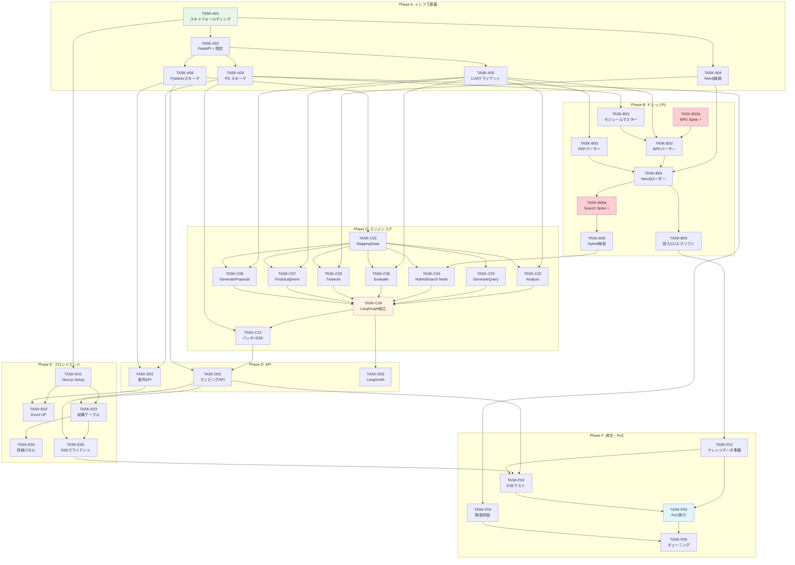

# Implementation Tasks: Phase 1 - 機能要件マッピングエンジン

> **ステータス**: Draft
> **対象Phase**: Phase 1
> **参照**: spec/phase1-mapping-engine/design.md / requirements.md

## 概要

Phase 1の実装タスクを依存関係順に6フェーズで構成。
PoC対象: 仕掛かり中の直近SAP案件（BPD 100-300件規模）。

---

## Phase A: インフラ・基盤構築

- [x] **TASK-A01**: プロジェクトスキャフォールディング
  - 詳細: docker-compose.yml（PostgreSQL専用コンテナ `proposal-creation-postgres:5435`、Neo4j専用 `proposal-creation-neo4j:7475/7688`、DB常時起動 + アプリは `profiles: ["full"]`）、backend/pyproject.toml、frontend/package.json（pnpm）、ディレクトリ構造、.env.example、.gitignore
  - 要件: （横断）
  - 依存: なし
  - ファイル: `docker-compose.yml`, `.env.example`, `.gitignore`, `backend/pyproject.toml`, `frontend/package.json`
  - 優先度: P0
  - 複雑度: M
  - 検証: `docker compose --profile full up -d --build` で PostgreSQL・Neo4j・backend・frontend の4コンテナが起動し、各サービスにヘルスチェック通過 ✅
  - ステータス: Completed

- [ ] **TASK-A02**: FastAPIエントリポイント + CORS + 設定管理
  - 詳細: `backend/app/main.py`（FastAPI app + CORSミドルウェア）、`backend/app/core/config.py`（pydantic-settings で環境変数読み込み、LLMモデル名・並行数・閾値の型付き設定）、`backend/app/core/database.py`（AsyncSession factory）
  - 要件: REQ-MAP-024
  - 依存: TASK-A01
  - ファイル: `backend/app/main.py`, `backend/app/core/config.py`, `backend/app/core/database.py`
  - 優先度: P0
  - 複雑度: S
  - 検証: `GET /health` が 200 を返す。設定値が環境変数から正しくロードされる（pytest）
  - ステータス: Pending

- [ ] **TASK-A03**: PostgreSQL スキーマ + SQLAlchemy モデル
  - 詳細: Case / FunctionalRequirement / MappingResult / ModuleClassification の4テーブル。Alembicマイグレーション設定。design.md ER図に準拠
  - 要件: REQ-MAP-024
  - 依存: TASK-A02
  - ファイル: `backend/app/models/case.py`, `backend/app/models/requirement.py`, `backend/app/models/mapping_result.py`, `backend/app/models/module_classification.py`, `backend/alembic/`
  - 優先度: P0
  - 複雑度: M
  - 検証: `alembic upgrade head` でテーブル作成。CRUD操作のpytestパス
  - ステータス: Pending

- [ ] **TASK-A04**: Neo4j接続 + インデックス作成
  - 詳細: neo4j AsyncDriver初期化。CJK Analyzerを指定したfulltextインデックス、VECTORインデックス、RANGEインデックスの5つを作成するスクリプト。design.md インデックス定義に準拠
  - 要件: REQ-MAP-002, 004, 005
  - 依存: TASK-A01
  - ファイル: `backend/app/core/neo4j_client.py`, `backend/scripts/setup_neo4j_indexes.py`
  - 優先度: P0
  - 複雑度: S
  - 検証: スクリプト実行後、`SHOW INDEXES` で5インデックスが確認できる。fulltextインデックスのanalyzerがcjkであること
  - ステータス: Pending

- [ ] **TASK-A05**: LLMクライアント抽象化 + リトライラッパー
  - 詳細: LangChain `init_chat_model()` ベースでプロバイダ切り替え可能なクライアント。tenacityによるエクスポネンシャルバックオフ（4回、1s-30s）。軽量/高性能の2インスタンス生成。`with_structured_output()` 対応
  - 要件: （横断: ADR-003, B-1リトライ戦略）
  - 依存: TASK-A02
  - ファイル: `backend/app/core/llm_client.py`
  - 優先度: P0
  - 複雑度: M
  - 検証: モック環境でリトライが正しく動作（429→バックオフ→リトライ）するpytest。軽量/高性能の2モデルが設定から切り替わること
  - ステータス: Pending

- [ ] **TASK-A06**: Pydantic スキーマ定義
  - 詳細: CaseResponse / MappingStartResponse / MappingResultItem / MappingResultsResponse / MappingResultDetail / ColumnMappingConfig。design.md Pydanticスキーマセクションに準拠
  - 要件: REQ-MAP-020, 021, 022, 023
  - 依存: TASK-A02
  - ファイル: `backend/app/schemas/case.py`, `backend/app/schemas/mapping.py`, `backend/app/schemas/column_mapping.py`
  - 優先度: P0
  - 複雑度: S
  - 検証: 各スキーマのバリデーションテスト（正常値/境界値/異常値）がpytestパス
  - ステータス: Pending

---

## Phase B: ナレッジパイプライン

- [ ] **TASK-B01**: モジュール分類マスターサービス
  - 詳細: COMP-MASTER実装。Scope Item ID→モジュール分類のCRUD。CSVバルクインポート対応。初期データとしてSAPモジュール分類マスターCSVを準備
  - 要件: REQ-MAP-007
  - 依存: TASK-A03
  - ファイル: `backend/app/services/knowledge/master.py`, `backend/data/module_classification_sap.csv`
  - 優先度: P0
  - 複雑度: S
  - 検証: CSVインポート→`get_module("1B4")` で `{"module":"SD", "module_name_ja":"販売管理"}` 取得のpytestパス
  - ステータス: Pending

- [ ] **TASK-B02a**: BPDフォーマットSpike（設計前提検証）
  - 詳細: BPDのdocxを1件開いて「Purpose / Business Conditions のセクション構造が design.md の想定通りか」を確認するSpike。見出しスタイル（Heading Level）、表の構造、Scope Item IDの記載パターン、JA版/EN版の対応関係を確認。想定と異なる場合は design.md COMP-PARSER-BPD の仕様を遡及修正する
  - 要件: REQ-MAP-001
  - 依存: なし（BPDドキュメントを手元で開くだけ）
  - ファイル: （調査結果を TASK-B02 着手前に design.md へ反映）
  - 優先度: P0
  - 複雑度: S（所要 30分〜1時間）
  - 検証: BPD 1ファイルセット（JA docx / EN docx / xlsx）の構造を文書化。design.md のパーサー仕様と差異がないこと、または差異を反映済みであること
  - ステータス: Pending

- [ ] **TASK-B02**: BPDパーサー実装
  - 詳細: COMP-PARSER-BPD実装。JA版docxからPurpose/Prerequisites/Business Conditions/Procedure Tables抽出、EN版docxから略語補完、xlsxからパラメータ抽出。LLM(軽量)でdescription生成。正規表現でScope Item ID参照を自動抽出しrelationsを構築
  - 要件: REQ-MAP-001
  - 依存: TASK-A05, TASK-B01, **TASK-B02a**
  - ファイル: `backend/app/services/knowledge/parser.py` (BPDParser, ScopeItemData)
  - 優先度: P0
  - 複雑度: XL
  - 検証: sampleディレクトリのBPD 3ファイルセット1件をパースし、ScopeItemDataが正しく生成されるpytest。description/relationsが妥当であること（手動確認含む）
  - ステータス: Pending

- [ ] **TASK-B03**: PDFパーサー実装
  - 詳細: COMP-PARSER-PDF実装。pdfplumberでテキスト+表抽出、LLM(軽量)でsummary生成、Scope Item ID参照検出→COVERSリレーション候補リスト生成
  - 要件: REQ-MAP-001a
  - 依存: TASK-A05
  - ファイル: `backend/app/services/knowledge/parser.py` (ModuleOverviewParser, ModuleOverviewData)
  - 優先度: P0
  - 複雑度: L
  - 検証: sampleのDiscovery WS PDF 1件をパースし、ModuleOverviewDataが正しく生成。covers_scope_itemsに期待IDが含まれるpytest
  - ステータス: Pending

- [ ] **TASK-B04**: Neo4jローダー + 4フェーズバルクロード
  - 詳細: COMP-LOADER実装。ScopeItem/ModuleOverviewノード投入、OpenAI Embedding生成（バッチ50件単位）、4フェーズ順序制約（SIノード→SIリレーション→MOノード→COVERSリレーション）。MERGE on idでべき等性保証
  - 要件: REQ-MAP-002, 004, 005
  - 依存: TASK-A04, TASK-B02, TASK-B03
  - ファイル: `backend/app/services/knowledge/loader.py`
  - 優先度: P0
  - 複雑度: L
  - 検証: 5件のScopeItem + 1件のModuleOverviewを投入→Neo4jで `MATCH (n) RETURN count(n)` が6。COVERSリレーション存在確認。Embedding次元が3072であること
  - ステータス: Pending

- [ ] **TASK-B05**: ナレッジ投入CLIスクリプト
  - 詳細: BPDディレクトリ一括解析→Neo4j投入のCLI。進捗表示（N/M件）、エラー件ログ出力、--dry-run オプション
  - 要件: REQ-MAP-001, 001a, 002
  - 依存: TASK-B04
  - ファイル: `backend/scripts/load_knowledge.py`
  - 優先度: P0
  - 複雑度: M
  - 検証: sample BPD 2-3セット + PDF 1ファイルを投入し、Neo4jにノード・リレーション・Embeddingが正しく格納される
  - ステータス: Pending

- [ ] **TASK-B06a**: Hybrid Search Spike（Neo4j検索基盤検証）
  - 詳細: TASK-B04完了後、5-10件のテストScopeItemノードを投入し以下を検証: (1) CJK fulltextインデックスで日本語キーワード（「受注」「在庫管理」等）が実際にヒットするか、(2) ベクトル検索+キーワード検索の2段階結合Cypherが正しく動作するか、(3) sigmoid正規化 `s/(s+1)` でスコアが0-1範囲に収まるか。ここが動かない場合、B06の設計自体（Cypher構文・インデックス構成）を変更する必要がある
  - 要件: REQ-MAP-003, 006
  - 依存: TASK-B04
  - ファイル: （Jupyter Notebook or 検証スクリプト `backend/scripts/spike_hybrid_search.py`）
  - 優先度: P0
  - 複雑度: S（所要 1〜2時間）
  - 検証: (1) 日本語fulltextクエリで期待ノードがヒット、(2) 2段階結合Cypherが構文エラーなく実行、(3) final_scoreが0-1範囲。いずれかNGの場合はdesign.md修正チケットを起票
  - ステータス: Pending

- [ ] **TASK-B06**: Hybrid検索サービス実装
  - 詳細: COMP-SEARCH実装。ベクトル検索 + fulltextキーワード検索（CJK Analyzer）の2段階Cypher。BM25スコアsigmoid正規化 `s/(s+1)`。product_namespaceフィルタ。final_score降順でtop_k件返却
  - 要件: REQ-MAP-003, 006
  - 依存: TASK-B04, **TASK-B06a**
  - ファイル: `backend/app/services/knowledge/search.py`
  - 優先度: P0
  - 複雑度: L
  - 検証: 投入済みノードに対し「受注管理」「在庫販売」等のクエリで関連ScopeItemがスコア付きで返却される統合テスト。レスポンス<1秒
  - ステータス: Pending

---

## Phase C: マッピングエンジンコア

- [ ] **TASK-C01**: MappingState定義
  - 詳細: LangGraph TypedDictステート定義。Input/Analysis/Search/Evaluation/Traversal/Judgment/Generation/Metadataの8グループ。design.md MappingStateに準拠
  - 要件: REQ-MAP-010
  - 依存: TASK-A06
  - ファイル: `backend/app/services/mapping/state.py`
  - 優先度: P0
  - 複雑度: S
  - 検証: TypedDictの型チェック通過。初期状態を構築するヘルパー関数のpytest
  - ステータス: Pending

- [ ] **TASK-C02**: AnalyzeRequirementノード
  - 詳細: LLM(軽量)で機能要件テキストからキーワード・業務ドメイン・要件意図を分析。Structured Output（analyzed_keywords, analyzed_domain, analyzed_intent）
  - 要件: REQ-MAP-010
  - 依存: TASK-A05, TASK-C01
  - ファイル: `backend/app/services/mapping/nodes/analyze.py`
  - 優先度: P0
  - 複雑度: M
  - 検証: 「受注登録画面で受注伝票を作成できること」→ keywords=["受注","受注伝票","受注登録"], domain="販売" のようなLLMレスポンスが得られるpytest（LLMモック+実LLM両方）
  - ステータス: Pending

- [ ] **TASK-C03**: GenerateQueryノード
  - 詳細: LLM(軽量)で分析結果+要件テキストから最適な検索クエリを生成。リトライ時はsearch_historyを参照し異なるクエリを生成
  - 要件: REQ-MAP-010, 015
  - 依存: TASK-C01
  - ファイル: `backend/app/services/mapping/nodes/generate_query.py`
  - 優先度: P0
  - 複雑度: M
  - 検証: 初回クエリとリトライ時クエリが異なることをpytestで検証
  - ステータス: Pending

- [ ] **TASK-C04**: HybridSearchノード（LangGraphノード統合）
  - 詳細: COMP-SEARCHのsearch()をLangGraphノードとしてラップ。クエリEmbedding生成→検索実行→search_results/search_scoreをstateにセット
  - 要件: REQ-MAP-003
  - 依存: TASK-B06, TASK-C01
  - ファイル: `backend/app/services/mapping/nodes/search.py`
  - 優先度: P0
  - 複雑度: S
  - 検証: モック検索結果がstateに正しくセットされるpytest
  - ステータス: Pending

- [ ] **TASK-C05**: EvaluateResultsノード
  - 詳細: COMP-EVALUATE実装。LLM(軽量)で検索結果の十分性を判定。is_sufficient / evaluation_reasoning / retry_count更新 / search_history追記
  - 要件: REQ-MAP-016
  - 依存: TASK-A05, TASK-C01
  - ファイル: `backend/app/services/mapping/nodes/evaluate.py`
  - 優先度: P0
  - 複雑度: M
  - 検証: スコア高の検索結果→sufficient=true、スコア低→sufficient=false、retry_count=3→強制proceedのpytest
  - ステータス: Pending

- [ ] **TASK-C06**: TraverseGraphノード
  - 詳細: COMP-TRAVERSE実装。上位3件のマッチノードに対し1-hop探索（PREREQUISITE/RELATED/FOLLOW_ON/COVERS）。ModuleOverviewコンテキスト取得。結果上限10ノード
  - 要件: REQ-MAP-017
  - 依存: TASK-A04, TASK-C01
  - ファイル: `backend/app/services/mapping/nodes/traverse.py`
  - 優先度: P0
  - 複雑度: M
  - 検証: テスト用Neo4jデータで、リレーションを持つノードからtraversed_nodesが正しく取得される統合テスト
  - ステータス: Pending

- [ ] **TASK-C07**: FinalJudgmentノード
  - 詳細: COMP-JUDGE実装。LLM(高性能) Structured Outputで判定レベル・llm_confidence・rationale・matched_items出力。判定レベルは製品別Enumで動的注入。confidence_score複合算出 `0.4*search_score + 0.6*llm_confidence`。temperature=0
  - 要件: REQ-MAP-011, 012, 014, NFR-MAP-005
  - 依存: TASK-A05, TASK-C01
  - ファイル: `backend/app/services/mapping/nodes/judge.py`
  - 優先度: P0
  - 複雑度: L
  - 検証: モック入力で判定レベル・確信度・根拠が正しく出力されるpytest。根拠にScope Item ID引用が含まれること。temperature=0の設定確認
  - ステータス: Pending

- [ ] **TASK-C08**: GenerateProposalTextノード
  - 詳細: COMP-GENERATE実装。LLM(高性能)で提案書転記可能テキスト生成。200-400文字。SAP標準機能名を含める。判定レベルに応じた対応方針を記述
  - 要件: REQ-MAP-013
  - 依存: TASK-A05, TASK-C01
  - ファイル: `backend/app/services/mapping/nodes/generate_proposal.py`
  - 優先度: P0
  - 複雑度: M
  - 検証: 生成されたproposal_textが200-400文字範囲、具体的機能名を含むことをpytestで検証
  - ステータス: Pending

- [ ] **TASK-C09**: LangGraphワークフロー組み立て
  - 詳細: COMP-AGENT実装。StateGraph定義、7ノード登録、エッジ定義（直線+条件分岐: evaluate_results→retry/proceed）、compile()。should_retry_search条件関数
  - 要件: REQ-MAP-010, 015, 018
  - 依存: TASK-C02〜C08
  - ファイル: `backend/app/services/mapping/agent.py`
  - 優先度: P0
  - 複雑度: M
  - 検証: 単一要件を`graph.ainvoke()`で実行し、全7ステップを通過してMappingStateが完成するE2Eテスト（LLMモック）
  - ステータス: Pending

- [ ] **TASK-C10**: バッチプロセッサ + SSEキュー
  - 詳細: MappingBatchProcessor実装。asyncio.Semaphore並行制御、エラーハンドリング（try/except→status=error永続化）、失敗率20%超でBatchAbortError、429時Semaphore動的縮小、SSEイベントキュー
  - 要件: REQ-MAP-018, NFR-MAP-001
  - 依存: TASK-C09, TASK-A03
  - ファイル: `backend/app/services/mapping/agent.py` (MappingBatchProcessor)
  - 優先度: P0
  - 複雑度: L
  - 検証: 10件のモック要件でバッチ実行→5並行で処理。1件意図的にエラー→status=errorで永続化。SSEキューにイベントが投入されるpytest
  - ステータス: Pending

---

## Phase D: APIレイヤー

- [ ] **TASK-D01**: 案件管理API（案件作成 + Excel取込）
  - 詳細: COMP-API-CASE実装。`POST /api/v1/cases`（multipart: file + name + product + column_mapping）。openpyxlでExcelパース、ColumnMappingConfigに従い正規化、Case+FunctionalRequirements一括作成。ファイルサイズ上限50MB、`read_only=True, data_only=True`
  - 要件: REQ-MAP-020, 024
  - 依存: TASK-A03, TASK-A06
  - ファイル: `backend/app/api/cases.py`
  - 優先度: P1
  - 複雑度: L
  - 検証: sampleのExcelファイルをアップロード→Case作成→FunctionalRequirementsが正しい件数で作成されるpytest。不正ファイル（非Excel、サイズ超過）でバリデーションエラー
  - ステータス: Pending

- [ ] **TASK-D02**: マッピングAPI（開始 + SSE + 結果取得）
  - 詳細: COMP-API-MAP実装。`POST /cases/{id}/mapping/start`（202 Accepted + BackgroundTask）、`GET /cases/{id}/mapping/stream`（SSE StreamingResponse）、`GET /cases/{id}/mapping/results`（フィルタ: judgment_level/confidence/importance/status）
  - 要件: REQ-MAP-021, 022, 023
  - 依存: TASK-C10, TASK-A06
  - ファイル: `backend/app/api/mapping.py`
  - 優先度: P1
  - 複雑度: L
  - 検証: start→202返却、SSE接続でrequirement_complete/batch_completeイベント受信、results GETでフィルタが正しく動作するpytest
  - ステータス: Pending

- [ ] **TASK-D03**: LangSmithトレーシング統合
  - 詳細: COMP-TRACING実装。環境変数でLangSmith有効化。各LLMノードに`@traceable`デコレータ。LangGraphの自動トレース確認。trace_idをMappingResultに保存
  - 要件: REQ-MAP-025, NFR-MAP-004
  - 依存: TASK-C09
  - ファイル: `backend/app/core/config.py`（設定追加）, 各ノードファイル
  - 優先度: P1
  - 複雑度: S
  - 検証: マッピング実行後、LangSmithダッシュボードでトレースが確認できる。MappingResult.langsmith_trace_idが正しく保存される
  - ステータス: Pending

---

## Phase E: フロントエンド

- [ ] **TASK-E01**: Next.jsプロジェクトセットアップ
  - 詳細: Next.js 15 App Router + TypeScript + Tailwind CSS + shadcn/ui初期化。レイアウト（ヘッダー+サイドバー）、API呼び出し基盤（fetch wrapper）
  - 要件: （横断）
  - 依存: TASK-A01
  - ファイル: `frontend/src/app/layout.tsx`, `frontend/src/lib/api.ts`
  - 優先度: P1
  - 複雑度: M
  - 検証: `npm run dev` でローカル起動、`/` にダッシュボード骨格が表示される
  - ステータス: Pending

- [ ] **TASK-E02**: Excelアップロード + カラムマッピングUI
  - 詳細: COMP-UI-UPLOAD実装。ファイルドロップゾーン→シート/ヘッダープレビュー→カラムマッピングフォーム（ColumnMappingConfig対応）→案件作成API呼び出し
  - 要件: REQ-MAP-030
  - 依存: TASK-E01, TASK-D01
  - ファイル: `frontend/src/app/cases/new/page.tsx`, `frontend/src/components/column-mapping-form.tsx`
  - 優先度: P1
  - 複雑度: L
  - 検証: Excelアップロード→ヘッダー行プレビュー→列マッピング→案件作成成功のE2E動作確認
  - ステータス: Pending

- [ ] **TASK-E03**: マッピング結果一覧テーブル
  - 詳細: COMP-UI-TABLE実装。TanStack Tableで列定義（seq, function_name, judgment_level, confidence, importance, status）。フィルタプリセット（「要レビュー: Must×Low」「全件」）。仮想スクロール
  - 要件: REQ-MAP-031, 034
  - 依存: TASK-E01, TASK-D02
  - ファイル: `frontend/src/app/cases/[id]/mapping/page.tsx`
  - 優先度: P1
  - 複雑度: L
  - 検証: 結果データがテーブル表示、フィルタ切り替えで絞り込み、300行でのスクロール性能
  - ステータス: Pending

- [ ] **TASK-E04**: 詳細サイドパネル
  - 詳細: COMP-UI-DETAIL実装。shadcn/ui Sheetでスライドアウトパネル。判定レベル/根拠/proposal_text/マッチScopeItems/関連ノード/LangSmithトレースリンク
  - 要件: REQ-MAP-032
  - 依存: TASK-E03
  - ファイル: `frontend/src/components/mapping-detail-panel.tsx`
  - 優先度: P1
  - 複雑度: M
  - 検証: テーブル行クリック→サイドパネル表示→全フィールドが正しくレンダリング
  - ステータス: Pending

- [ ] **TASK-E05**: SSEクライアント + 進捗バー
  - 詳細: COMP-UI-SSE実装。カスタムReact Hook `useMappingSSE(caseId)`。EventSource APIラップ。requirement_completeでテーブル行追加、progressで進捗バー更新、batch_completeで完了表示、errorでトースト通知
  - 要件: REQ-MAP-033
  - 依存: TASK-E03, TASK-D02
  - ファイル: `frontend/src/lib/use-mapping-sse.ts`, `frontend/src/components/mapping-progress-bar.tsx`
  - 優先度: P1
  - 複雑度: M
  - 検証: マッピング開始→SSE接続→リアルタイムで行追加+進捗バー更新→batch_completeで完了表示のE2E動作確認
  - ステータス: Pending

---

## Phase F: 統合・PoC検証

- [ ] **TASK-F01**: PoC用ナレッジデータ準備
  - 詳細: 仕掛かり案件のBPDドキュメント（100-300セット）をload_knowledge.pyで投入。Discovery WS PDF投入。投入結果のサマリーレポート出力（ノード数、リレーション数、Embeddingカバレッジ）
  - 要件: REQ-MAP-001, 001a, 002
  - 依存: TASK-B05
  - ファイル: （CLIスクリプト実行）
  - 優先度: P1
  - 複雑度: L
  - 検証: Neo4jに100-300 ScopeItemノード + 数件ModuleOverviewノードが投入済み。全ノードにEmbeddingあり
  - ステータス: Pending

- [ ] **TASK-F02**: E2E統合テスト
  - 詳細: Docker Compose環境で全フロー（Excel UP→案件作成→マッピング開始→SSE受信→結果取得→サイドパネル表示）を通しで実行。少数要件（10件）で動作確認
  - 要件: （横断）
  - 依存: TASK-D02, TASK-E05, TASK-F01
  - ファイル: `backend/tests/e2e/test_full_flow.py`
  - 優先度: P1
  - 複雑度: L
  - 検証: 10件の要件が全てstatus=completedになり、judgment_level/confidence/proposal_textが全て非空
  - ステータス: Pending

- [ ] **TASK-F03**: PoC実行（フル案件マッピング）
  - 詳細: 仕掛かり案件のRFP Excel（100-300要件）をフル投入→マッピング実行。処理時間・エラー率・LLMコスト計測。結果をレビューし、判定品質を人間チェック
  - 要件: NFR-MAP-001, 002
  - 依存: TASK-F01, TASK-F02
  - ファイル: （運用実行）
  - 優先度: P1
  - 複雑度: L
  - 検証: 200要件を30分以内に処理完了（NFR-MAP-001）。LLMコスト<$50（NFR-MAP-002）。エラー率<5%
  - ステータス: Pending

- [ ] **TASK-F04**: 精度評価スクリプト実装
  - 詳細: COMP-ACCURACY実装。正解データExcel読み込み→function_nameで突合→判定一致率/確信度別精度/Confusion Matrix/不一致件リスト算出→JSON+コンソールレポート出力
  - 要件: NFR-MAP-003
  - 依存: TASK-A03
  - ファイル: `backend/scripts/evaluate_accuracy.py`
  - 優先度: P2
  - 複雑度: M
  - 検証: モック正解データ+モック結果データで一致率が正しく算出されるpytest
  - ステータス: Pending

- [ ] **TASK-F05**: チューニング・パラメータ最適化
  - 詳細: PoC結果に基づき、以下のパラメータを調整: vector_weight/keyword_weight、確信度閾値（High/Medium/Low境界）、検索top_k、リトライ回数、プロンプトテンプレート。改善前後の精度比較
  - 要件: NFR-MAP-003
  - 依存: TASK-F03, TASK-F04
  - ファイル: `backend/app/core/config.py`（パラメータ）, 各ノードのプロンプト
  - 優先度: P2
  - 複雑度: L
  - 検証: チューニング後の精度が70%以上（NFR-MAP-003ゲート）
  - ステータス: Pending

---

## 依存関係図



**凡例**: 緑=起点 / 赤=Spike（リスク早期検証） / 橙=クリティカルパス合流点 / 青=PoCゴール

---

## クリティカルパス

```
TASK-A01 → A02 → A05 → B02a → B02 → B04 → B06a → B06 → C04 → C09 → C10 → D02 → F02 → F03
```

このパス上のタスクの遅延がプロジェクト全体の遅延に直結する。
**2つのSpikeタスクでリスクを早期検出**:
- **TASK-B02a（BPD Spike）**: BPDドキュメント構造が設計前提と合致するかを最初に確認。不一致時はdesign.md遡及修正
- **TASK-B06a（Search Spike）**: CJK fulltext + 2段階結合Cypherの動作検証。Neo4j側の技術的前提を実証

---

## 並行作業の推奨

| タイミング | パス1 | パス2 | 備考 |
|-----------|-------|-------|------|
| Phase A開始直後 | **B02a（BPD Spike）** | A02〜A06（基盤構築） | Spikeは環境不要、即着手可 |
| Phase A完了後 | B02→B04→B06a→B06（ナレッジPL） | C01→C02〜C08（エンジンノード） | B06aはB04完了後すぐ実施 |
| Phase B完了後 | C09→C10（エンジン統合） | D01（案件API） | |
| Phase C完了後 | D02→D03（API完成） | E01→E02〜E05（フロントエンド） | |

---

## 進捗サマリー

| ステータス | タスク数 |
|-----------|---------|
| Completed | 1 |
| In Progress | 0 |
| Pending | 31 |
| **Total** | **32** |
