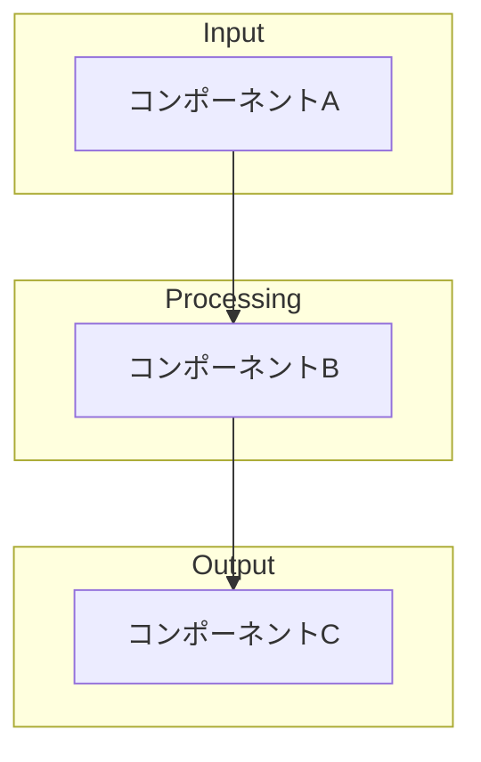
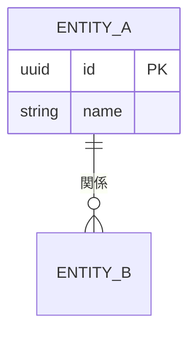
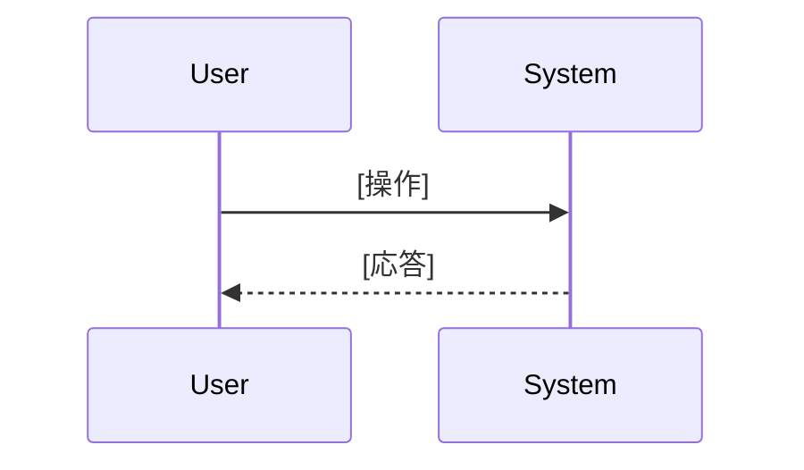

# Design: [機能名]

## サマリーテーブル

| コンポーネント | 技術 | 目的 |
|--------------|------|------|
| [名称] | [技術] | [役割] |

## システムアーキテクチャ

## データモデル（ER図）

## コンポーネント設計

### [コンポーネント名]
- **責務**: [このコンポーネントの責任範囲]
- **インターフェース**: [公開メソッド/API]
- **依存**: [依存するコンポーネント]

## シーケンス図

## アーキテクチャ決定記録（ADR）

### ADR-001: [決定タイトル]
- **ステータス**: 提案/承認/廃止
- **コンテキスト**: [なぜこの決定が必要か]
- **決定**: [何を決定したか]
- **理由**: [なぜその選択をしたか]
- **影響**: [この決定による影響]
