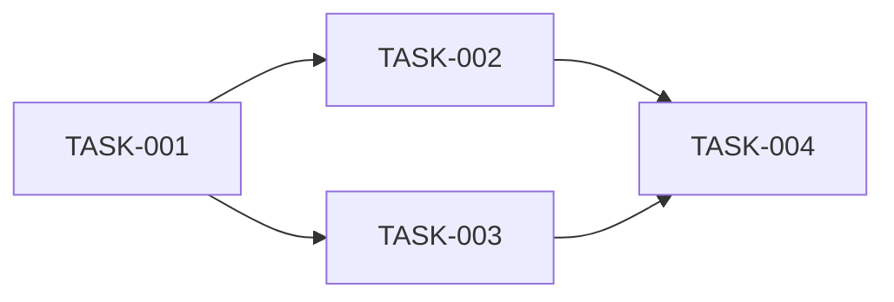

# Implementation Tasks: [機能名]

## 概要
優先度順のタスクリスト。各タスクは要件にリンク。

## タスク一覧

### Phase 1: [フェーズ名]

- [ ] **TASK-001**: [タスク説明]
  - 詳細: [実装内容の詳細]
  - 要件: REQ-XXX-001
  - 依存: なし
  - ファイル: [対象ファイルパス]
  - 優先度: P0
  - 複雑度: S/M/L/XL
  - 検証: [完了の定義]
  - ステータス: Pending / In Progress / Completed

### Phase 2: [フェーズ名]

- [ ] **TASK-002**: [タスク説明]
  - 詳細: [実装内容の詳細]
  - 要件: REQ-XXX-002
  - 依存: TASK-001
  - ファイル: [対象ファイルパス]
  - 優先度: P1
  - 複雑度: M
  - 検証: [完了の定義]
  - ステータス: Pending

## 依存関係図

## 進捗サマリー

| ステータス | タスク数 |
|-----------|---------|
| Completed | 0 |
| In Progress | 0 |
| Pending | 0 |
| **Total** | **0** |
